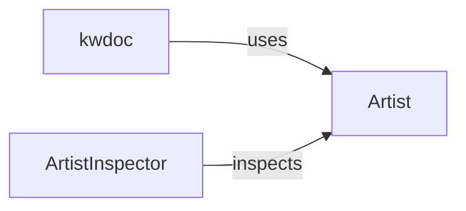

## Component Details

The matplotlib.artist module defines the base Artist class, which is the foundation for all visual elements in matplotlib figures. It manages properties like visibility, transformations, clipping, and callbacks, and provides the core drawing functionality. The ArtistInspector class allows for introspection of Artist properties, aiding in interactive editing and documentation. The kwdoc decorator is used to document keyword arguments, particularly for the Artist's `set` method, enhancing discoverability and usability.

### Artist
The Artist class is the base class for all drawable objects in matplotlib. It encapsulates the properties for rendering visual elements in a figure. It manages attributes like color, transform, clip properties, visibility, and alpha. It also handles picking events and contains methods for drawing and updating the artist on the canvas.
**Related Classes/Methods**:

- <a href="https://github.com/matplotlib/matplotlib/blob/master/lib/matplotlib/artist.py#L110-L1395" target="_blank" rel="noopener noreferrer">`matplotlib.artist.Artist` (110:1395)</a>
- <a href="https://github.com/matplotlib/matplotlib/blob/master/lib/matplotlib/artist.py#L173-L207" target="_blank" rel="noopener noreferrer">`matplotlib.artist.Artist.__init__` (173:207)</a>
- <a href="https://github.com/matplotlib/matplotlib/blob/master/lib/matplotlib/artist.py#L119-L143" target="_blank" rel="noopener noreferrer">`matplotlib.artist.Artist.__init_subclass__` (119:143)</a>
- <a href="https://github.com/matplotlib/matplotlib/blob/master/lib/matplotlib/artist.py#L214-L250" target="_blank" rel="noopener noreferrer">`matplotlib.artist.Artist.remove` (214:250)</a>
- <a href="https://github.com/matplotlib/matplotlib/blob/master/lib/matplotlib/artist.py#L351-L376" target="_blank" rel="noopener noreferrer">`matplotlib.artist.Artist.get_tightbbox` (351:376)</a>
- <a href="https://github.com/matplotlib/matplotlib/blob/master/lib/matplotlib/artist.py#L438-L449" target="_blank" rel="noopener noreferrer">`matplotlib.artist.Artist.set_transform` (438:449)</a>
- <a href="https://github.com/matplotlib/matplotlib/blob/master/lib/matplotlib/artist.py#L464-L480" target="_blank" rel="noopener noreferrer">`matplotlib.artist.Artist._different_canvas` (464:480)</a>
- <a href="https://github.com/matplotlib/matplotlib/blob/master/lib/matplotlib/artist.py#L502-L510" target="_blank" rel="noopener noreferrer">`matplotlib.artist.Artist.pickable` (502:510)</a>
- <a href="https://github.com/matplotlib/matplotlib/blob/master/lib/matplotlib/artist.py#L512-L548" target="_blank" rel="noopener noreferrer">`matplotlib.artist.Artist.pick` (512:548)</a>
- <a href="https://github.com/matplotlib/matplotlib/blob/master/lib/matplotlib/artist.py#L741-L763" target="_blank" rel="noopener noreferrer">`matplotlib.artist.Artist.set_figure` (741:763)</a>
- <a href="https://github.com/matplotlib/matplotlib/blob/master/lib/matplotlib/artist.py#L769-L785" target="_blank" rel="noopener noreferrer">`matplotlib.artist.Artist.set_clip_box` (769:785)</a>
- <a href="https://github.com/matplotlib/matplotlib/blob/master/lib/matplotlib/artist.py#L787-L847" target="_blank" rel="noopener noreferrer">`matplotlib.artist.Artist.set_clip_path` (787:847)</a>
- <a href="https://github.com/matplotlib/matplotlib/blob/master/lib/matplotlib/artist.py#L875-L897" target="_blank" rel="noopener noreferrer">`matplotlib.artist.Artist._fully_clipped_to_axes` (875:897)</a>
- <a href="https://github.com/matplotlib/matplotlib/blob/master/lib/matplotlib/artist.py#L921-L936" target="_blank" rel="noopener noreferrer">`matplotlib.artist.Artist.set_clip_on` (921:936)</a>
- <a href="https://github.com/matplotlib/matplotlib/blob/master/lib/matplotlib/artist.py#L997-L1014" target="_blank" rel="noopener noreferrer">`matplotlib.artist.Artist.draw` (997:1014)</a>
- <a href="https://github.com/matplotlib/matplotlib/blob/master/lib/matplotlib/artist.py#L1016-L1033" target="_blank" rel="noopener noreferrer">`matplotlib.artist.Artist.set_alpha` (1016:1033)</a>
- <a href="https://github.com/matplotlib/matplotlib/blob/master/lib/matplotlib/artist.py#L1035-L1056" target="_blank" rel="noopener noreferrer">`matplotlib.artist.Artist._set_alpha_for_array` (1035:1056)</a>
- <a href="https://github.com/matplotlib/matplotlib/blob/master/lib/matplotlib/artist.py#L1058-L1069" target="_blank" rel="noopener noreferrer">`matplotlib.artist.Artist.set_visible` (1058:1069)</a>
- <a href="https://github.com/matplotlib/matplotlib/blob/master/lib/matplotlib/artist.py#L1071-L1089" target="_blank" rel="noopener noreferrer">`matplotlib.artist.Artist.set_animated` (1071:1089)</a>
- <a href="https://github.com/matplotlib/matplotlib/blob/master/lib/matplotlib/artist.py#L1108-L1121" target="_blank" rel="noopener noreferrer">`matplotlib.artist.Artist.set_label` (1108:1121)</a>
- <a href="https://github.com/matplotlib/matplotlib/blob/master/lib/matplotlib/artist.py#L1127-L1141" target="_blank" rel="noopener noreferrer">`matplotlib.artist.Artist.set_zorder` (1127:1141)</a>
- <a href="https://github.com/matplotlib/matplotlib/blob/master/lib/matplotlib/artist.py#L1170-L1185" target="_blank" rel="noopener noreferrer">`matplotlib.artist.Artist.update_from` (1170:1185)</a>
- <a href="https://github.com/matplotlib/matplotlib/blob/master/lib/matplotlib/artist.py#L1187-L1189" target="_blank" rel="noopener noreferrer">`matplotlib.artist.Artist.properties` (1187:1189)</a>
- <a href="https://github.com/matplotlib/matplotlib/blob/master/lib/matplotlib/artist.py#L1191-L1216" target="_blank" rel="noopener noreferrer">`matplotlib.artist.Artist._update_props` (1191:1216)</a>
- <a href="https://github.com/matplotlib/matplotlib/blob/master/lib/matplotlib/artist.py#L1218-L1227" target="_blank" rel="noopener noreferrer">`matplotlib.artist.Artist.update` (1218:1227)</a>
- <a href="https://github.com/matplotlib/matplotlib/blob/master/lib/matplotlib/artist.py#L1229-L1238" target="_blank" rel="noopener noreferrer">`matplotlib.artist.Artist._internal_update` (1229:1238)</a>
- <a href="https://github.com/matplotlib/matplotlib/blob/master/lib/matplotlib/artist.py#L1240-L1244" target="_blank" rel="noopener noreferrer">`matplotlib.artist.Artist.set` (1240:1244)</a>
- <a href="https://github.com/matplotlib/matplotlib/blob/master/lib/matplotlib/artist.py#L1247-L1256" target="_blank" rel="noopener noreferrer">`matplotlib.artist.Artist._cm_set` (1247:1256)</a>
- <a href="https://github.com/matplotlib/matplotlib/blob/master/lib/matplotlib/artist.py#L1258-L1300" target="_blank" rel="noopener noreferrer">`matplotlib.artist.Artist.findobj` (1258:1300)</a>
- <a href="https://github.com/matplotlib/matplotlib/blob/master/lib/matplotlib/artist.py#L775-L800" target="_blank" rel="noopener noreferrer">`matplotlib.artist.Artist._XYPair` (775:800)</a>
- <a href="https://github.com/matplotlib/matplotlib/blob/master/lib/matplotlib/artist.py#L23-L41" target="_blank" rel="noopener noreferrer">`matplotlib.artist.Artist._prevent_rasterization` (23:41)</a>

### ArtistInspector
The ArtistInspector class is responsible for inspecting the properties of an Artist object. It provides methods to retrieve the settable properties and their documentation, which is used for interactive property editing and introspection.
**Related Classes/Methods**:

- <a href="https://github.com/matplotlib/matplotlib/blob/master/lib/matplotlib/artist.py#L1410-L1709" target="_blank" rel="noopener noreferrer">`matplotlib.artist.ArtistInspector` (1410:1709)</a>
- <a href="https://github.com/matplotlib/matplotlib/blob/master/lib/matplotlib/artist.py#L1514-L1531" target="_blank" rel="noopener noreferrer">`matplotlib.artist.ArtistInspector.get_setters` (1514:1531)</a>
- <a href="https://github.com/matplotlib/matplotlib/blob/master/lib/matplotlib/artist.py#L1675-L1694" target="_blank" rel="noopener noreferrer">`matplotlib.artist.ArtistInspector.properties` (1675:1694)</a>

### kwdoc
The `kwdoc` is a decorator or function used to document the keyword arguments of a function or method. It's used to generate documentation for the `set` method of the Artist class.
**Related Classes/Methods**:

- <a href="https://github.com/matplotlib/matplotlib/blob/master/lib/matplotlib/artist.py#L1835-L1854" target="_blank" rel="noopener noreferrer">`matplotlib.artist.kwdoc` (1835:1854)</a>