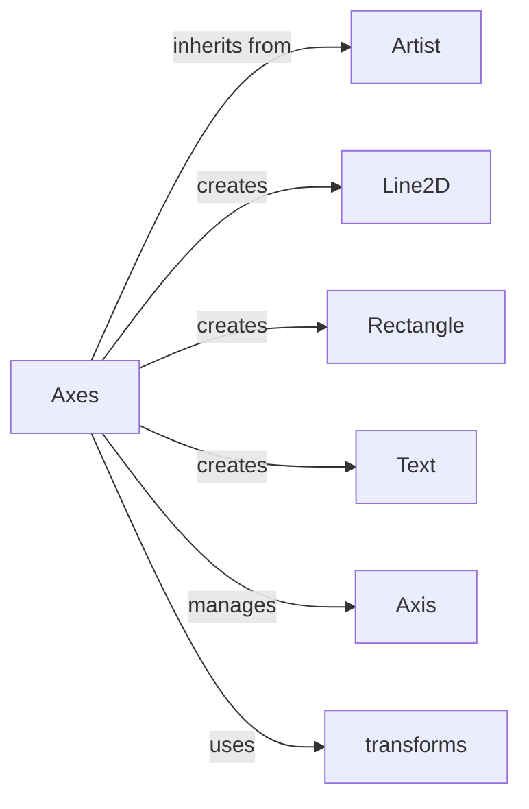

## Component Details

The Matplotlib Axes component is the central part of the Matplotlib library, responsible for creating and managing plots. It acts as a container for all plot elements, including data, axes, and artists. The Axes class provides a wide range of methods for plotting different types of data, customizing the appearance of the plot, and interacting with other Matplotlib components. It manages the coordinate system, draws the axes, and handles user interactions such as zooming and panning. The Axes component relies heavily on other components like Artist, Line2D, Rectangle, Text, and transforms to create and render the plot.

### Axes
The central class of the matplotlib object-oriented interface. It is responsible for creating and managing the coordinate system, plotting data, and creating the visual representation of the plot. It handles the majority of plotting methods such as plot, scatter, bar, etc.
**Related Classes/Methods**:

- <a href="https://github.com/matplotlib/matplotlib/blob/master/lib/matplotlib/axes/_axes.py#L68-L8855" target="_blank" rel="noopener noreferrer">`lib.matplotlib.axes._axes.Axes` (68:8855)</a>

### Artist
The base class for all objects that render into a Figure. It encapsulates the properties for display such as color, line width, line style, etc. The Axes class interacts with Artist subclasses to add them to the plot.
**Related Classes/Methods**:

- <a href="https://github.com/matplotlib/matplotlib/blob/master/lib/matplotlib/artist.py#L110-L1395" target="_blank" rel="noopener noreferrer">`matplotlib.artist.Artist` (110:1395)</a>

### Line2D
Represents a line on a plot. Used by the plot, axhline, axvline, and errorbar methods of the Axes class to draw lines on the plot.
**Related Classes/Methods**:

- <a href="https://github.com/matplotlib/matplotlib/blob/master/lib/matplotlib/lines.py#L243-L1466" target="_blank" rel="noopener noreferrer">`matplotlib.lines.Line2D` (243:1466)</a>

### Rectangle
Represents a rectangle patch. Used by the axhspan, axvspan, and bar methods of the Axes class to draw rectangular patches on the plot.
**Related Classes/Methods**:

- <a href="https://github.com/matplotlib/matplotlib/blob/master/lib/matplotlib/patches.py#L747-L961" target="_blank" rel="noopener noreferrer">`matplotlib.patches.Rectangle` (747:961)</a>

### Text
Represents a text object. Used by the text, annotate, and bar_label methods of the Axes class to add text to the plot.
**Related Classes/Methods**:

- <a href="https://github.com/matplotlib/matplotlib/blob/master/lib/matplotlib/text.py#L95-L1423" target="_blank" rel="noopener noreferrer">`matplotlib.text.Text` (95:1423)</a>

### Axis
Represents the axis of a plot. Used by the bar and spy methods of the Axes class to set the ticks and ticklabels of the axis.
**Related Classes/Methods**:

- <a href="https://github.com/matplotlib/matplotlib/blob/master/lib/matplotlib/axis.py#L544-L2330" target="_blank" rel="noopener noreferrer">`matplotlib.axis.Axis` (544:2330)</a>

### transforms
Contains classes for performing transformations. Used by many methods of the Axes class to transform data and coordinates.
**Related Classes/Methods**:

- <a href="https://github.com/matplotlib/matplotlib/blob/master/lib/matplotlib/transforms.py#LNone-LNone" target="_blank" rel="noopener noreferrer">`matplotlib.transforms` (full file reference)</a>