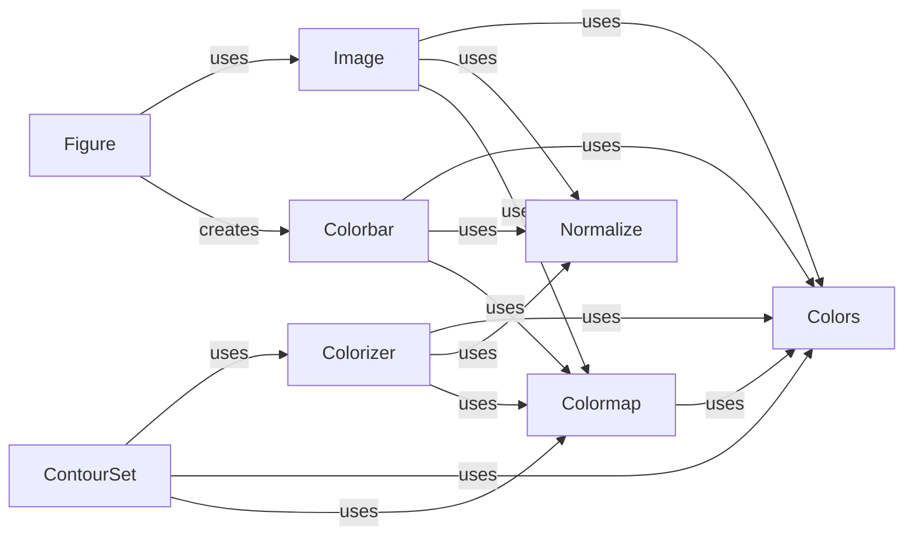

## Component Details

The ColorManager component in Matplotlib is responsible for handling color management, colormaps, and data normalization. It provides the tools necessary to map numerical data to colors, enabling the creation of informative and visually appealing plots. The core functionality revolves around defining colormaps, normalizing data into the [0, 1] range for color mapping, and providing utilities for color conversions and manipulations. This system is used by various plotting functions like contour plots, image displays, and colorbars to represent data visually.

### Colormap
The Colormap class defines the mapping from data values to colors. It provides methods for retrieving colors based on input values, handling out-of-range values, and creating derived colormaps. It is a central component for translating data into a visual representation.
**Related Classes/Methods**:

- <a href="https://github.com/matplotlib/matplotlib/blob/master/lib/matplotlib/colors.py#L703-L1056" target="_blank" rel="noopener noreferrer">`lib.matplotlib.colors.Colormap` (703:1056)</a>
- <a href="https://github.com/matplotlib/matplotlib/blob/master/lib/matplotlib/colors.py#L1059-L1266" target="_blank" rel="noopener noreferrer">`lib.matplotlib.colors.LinearSegmentedColormap` (1059:1266)</a>
- <a href="https://github.com/matplotlib/matplotlib/blob/master/lib/matplotlib/colors.py#L1269-L1399" target="_blank" rel="noopener noreferrer">`lib.matplotlib.colors.ListedColormap` (1269:1399)</a>
- <a href="https://github.com/matplotlib/matplotlib/blob/master/lib/matplotlib/colors.py#L1402-L1652" target="_blank" rel="noopener noreferrer">`lib.matplotlib.colors.MultivarColormap` (1402:1652)</a>
- <a href="https://github.com/matplotlib/matplotlib/blob/master/lib/matplotlib/colors.py#L1655-L2154" target="_blank" rel="noopener noreferrer">`lib.matplotlib.colors.BivarColormap` (1655:2154)</a>
- <a href="https://github.com/matplotlib/matplotlib/blob/master/lib/matplotlib/colors.py#L2157-L2204" target="_blank" rel="noopener noreferrer">`lib.matplotlib.colors.SegmentedBivarColormap` (2157:2204)</a>
- <a href="https://github.com/matplotlib/matplotlib/blob/master/lib/matplotlib/colors.py#L2207-L2257" target="_blank" rel="noopener noreferrer">`lib.matplotlib.colors.BivarColormapFromImage` (2207:2257)</a>

### Normalize
The Normalize class scales data values to the range [0, 1], which is essential for mapping data to colors using a colormap. It handles clipping and autoscaling the normalization range, ensuring that data is properly prepared for color mapping.
**Related Classes/Methods**:

- <a href="https://github.com/matplotlib/matplotlib/blob/master/lib/matplotlib/colors.py#L2260-L2495" target="_blank" rel="noopener noreferrer">`lib.matplotlib.colors.Normalize` (2260:2495)</a>
- <a href="https://github.com/matplotlib/matplotlib/blob/master/lib/matplotlib/colors.py#L2498-L2590" target="_blank" rel="noopener noreferrer">`lib.matplotlib.colors.TwoSlopeNorm` (2498:2590)</a>
- <a href="https://github.com/matplotlib/matplotlib/blob/master/lib/matplotlib/colors.py#L2593-L2708" target="_blank" rel="noopener noreferrer">`lib.matplotlib.colors.CenteredNorm` (2593:2708)</a>
- <a href="https://github.com/matplotlib/matplotlib/blob/master/lib/matplotlib/colors.py#L2990-L3075" target="_blank" rel="noopener noreferrer">`lib.matplotlib.colors.PowerNorm` (2990:3075)</a>
- <a href="https://github.com/matplotlib/matplotlib/blob/master/lib/matplotlib/colors.py#L3078-L3203" target="_blank" rel="noopener noreferrer">`lib.matplotlib.colors.BoundaryNorm` (3078:3203)</a>
- <a href="https://github.com/matplotlib/matplotlib/blob/master/lib/matplotlib/colors.py#L2761-L2866" target="_blank" rel="noopener noreferrer">`lib.matplotlib.colors._make_norm_from_scale` (2761:2866)</a>
- <a href="https://github.com/matplotlib/matplotlib/blob/master/lib/matplotlib/colors.py#L2711-L2757" target="_blank" rel="noopener noreferrer">`lib.matplotlib.colors.make_norm_from_scale` (2711:2757)</a>

### Colors
The colors module provides functions for color conversions, color manipulation, and color-related utilities. It includes functions for converting color names to RGBA values, creating colormaps, and performing color comparisons. It is a fundamental building block for color handling in Matplotlib.
**Related Classes/Methods**:

- <a href="https://github.com/matplotlib/matplotlib/blob/master/lib/matplotlib/colors.py#LNone-LNone" target="_blank" rel="noopener noreferrer">`lib.matplotlib.colors` (full file reference)</a>
- <a href="https://github.com/matplotlib/matplotlib/blob/master/lib/matplotlib/colors.py#L306-L350" target="_blank" rel="noopener noreferrer">`lib.matplotlib.colors.to_rgba` (306:350)</a>
- <a href="https://github.com/matplotlib/matplotlib/blob/master/lib/matplotlib/colors.py#L546-L552" target="_blank" rel="noopener noreferrer">`lib.matplotlib.colors.to_rgb` (546:552)</a>
- <a href="https://github.com/matplotlib/matplotlib/blob/master/lib/matplotlib/colors.py#L555-L574" target="_blank" rel="noopener noreferrer">`lib.matplotlib.colors.to_hex` (555:574)</a>
- <a href="https://github.com/matplotlib/matplotlib/blob/master/lib/matplotlib/colors.py#L438-L543" target="_blank" rel="noopener noreferrer">`lib.matplotlib.colors.to_rgba_array` (438:543)</a>
- <a href="https://github.com/matplotlib/matplotlib/blob/master/lib/matplotlib/colors.py#L226-L236" target="_blank" rel="noopener noreferrer">`lib.matplotlib.colors.is_color_like` (226:236)</a>

### Colorbar
The Colorbar class creates and manages colorbars, which are visual representations of the color mapping used in a plot. It handles the layout, ticks, labels, and extended color regions of the colorbar, providing a key to understanding the color-to-data relationship in a plot.
**Related Classes/Methods**:

- <a href="https://github.com/matplotlib/matplotlib/blob/master/lib/matplotlib/colorbar.py#L198-L1334" target="_blank" rel="noopener noreferrer">`lib.matplotlib.colorbar.Colorbar` (198:1334)</a>
- <a href="https://github.com/matplotlib/matplotlib/blob/master/lib/matplotlib/colorbar.py#L125-L145" target="_blank" rel="noopener noreferrer">`lib.matplotlib.colorbar._ColorbarSpine` (125:145)</a>
- <a href="https://github.com/matplotlib/matplotlib/blob/master/lib/matplotlib/colorbar.py#L1360-L1363" target="_blank" rel="noopener noreferrer">`lib.matplotlib.colorbar._get_orientation_from_location` (1360:1363)</a>
- <a href="https://github.com/matplotlib/matplotlib/blob/master/lib/matplotlib/colorbar.py#L1366-L1369" target="_blank" rel="noopener noreferrer">`lib.matplotlib.colorbar._get_ticklocation_from_orientation` (1366:1369)</a>

### ContourSet
The ContourSet class creates and manages contour plots, which are visual representations of level curves of a function. It handles the calculation of contour lines, the mapping of data values to colors, and the drawing of the contour lines, allowing for the visualization of data with constant values.
**Related Classes/Methods**:

- <a href="https://github.com/matplotlib/matplotlib/blob/master/lib/matplotlib/contour.py#L557-L1288" target="_blank" rel="noopener noreferrer">`lib.matplotlib.contour.ContourSet` (557:1288)</a>
- <a href="https://github.com/matplotlib/matplotlib/blob/master/lib/matplotlib/contour.py#L1292-L1468" target="_blank" rel="noopener noreferrer">`lib.matplotlib.contour.QuadContourSet` (1292:1468)</a>

### Figure
The Figure class represents the top-level container for all plot elements. It provides methods for creating subplots, adding artists, and saving the figure to a file. It serves as the canvas upon which all plots are drawn.
**Related Classes/Methods**:

- <a href="https://github.com/matplotlib/matplotlib/blob/master/lib/matplotlib/figure.py#L118-L2212" target="_blank" rel="noopener noreferrer">`lib.matplotlib.figure.FigureBase` (118:2212)</a>
- <a href="https://github.com/matplotlib/matplotlib/blob/master/lib/matplotlib/figure.py#L2424-L3644" target="_blank" rel="noopener noreferrer">`lib.matplotlib.figure.Figure` (2424:3644)</a>

### Image
The Image module is responsible for displaying images in matplotlib. It handles the loading, scaling, and color mapping of image data, allowing for the visualization of raster data.
**Related Classes/Methods**:

- <a href="https://github.com/matplotlib/matplotlib/blob/master/lib/matplotlib/image.py#L233-L824" target="_blank" rel="noopener noreferrer">`lib.matplotlib.image._ImageBase` (233:824)</a>
- <a href="https://github.com/matplotlib/matplotlib/blob/master/lib/matplotlib/image.py#L1323-L1386" target="_blank" rel="noopener noreferrer">`lib.matplotlib.image.FigureImage` (1323:1386)</a>

### Colorizer
The Colorizer and ScalarMappable classes provide a higher-level interface for mapping data values to colors. They handle the creation and management of colormaps and normalization objects, and provide methods for retrieving colors based on input values, simplifying the process of color mapping for artists.
**Related Classes/Methods**:

- <a href="https://github.com/matplotlib/matplotlib/blob/master/lib/matplotlib/colorizer.py#L38-L322" target="_blank" rel="noopener noreferrer">`lib.matplotlib.colorizer.Colorizer` (38:322)</a>
- <a href="https://github.com/matplotlib/matplotlib/blob/master/lib/matplotlib/colorizer.py#L506-L610" target="_blank" rel="noopener noreferrer">`lib.matplotlib.colorizer._ScalarMappable` (506:610)</a>
- <a href="https://github.com/matplotlib/matplotlib/blob/master/lib/matplotlib/colorizer.py#L642-L675" target="_blank" rel="noopener noreferrer">`lib.matplotlib.colorizer.ColorizingArtist` (642:675)</a>
- <a href="https://github.com/matplotlib/matplotlib/blob/master/lib/matplotlib/colorizer.py#L325-L503" target="_blank" rel="noopener noreferrer">`lib.matplotlib.colorizer._ColorizerInterface` (325:503)</a>
- <a href="https://github.com/matplotlib/matplotlib/blob/master/lib/matplotlib/colorizer.py#L678-L703" target="_blank" rel="noopener noreferrer">`lib.matplotlib.colorizer._auto_norm_from_scale` (678:703)</a>