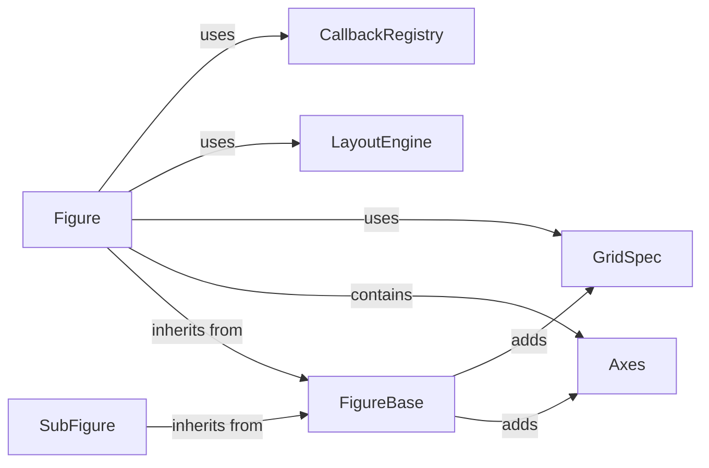

## Component Details

The matplotlib Figure component serves as the top-level container for a plot, encompassing all elements like axes, titles, legends, and the canvas itself. It manages the layout of these elements, ensuring they are arranged effectively and without overlap. The Figure also provides methods for saving the plot to various file formats, making it a central point for outputting visualizations. It interacts with various components such as Axes, GridSpec, LayoutEngine, and CallbackRegistry to create and manage the plot.

### Figure
The Figure class is the top-level container for all plot elements. It encapsulates the entire figure, including axes, titles, legends, and the canvas. It manages the layout of these elements and provides methods for saving the figure to various formats.
**Related Classes/Methods**:

- <a href="https://github.com/matplotlib/matplotlib/blob/master/lib/matplotlib/figure.py#L2424-L3644" target="_blank" rel="noopener noreferrer">`lib.matplotlib.figure.Figure` (2424:3644)</a>
- <a href="https://github.com/matplotlib/matplotlib/blob/master/lib/matplotlib/figure.py#L2463-L2653" target="_blank" rel="noopener noreferrer">`lib.matplotlib.figure.Figure.__init__` (2463:2653)</a>
- <a href="https://github.com/matplotlib/matplotlib/blob/master/lib/matplotlib/figure.py#L3238-L3263" target="_blank" rel="noopener noreferrer">`lib.matplotlib.figure.Figure.draw` (3238:3263)</a>
- <a href="https://github.com/matplotlib/matplotlib/blob/master/lib/matplotlib/figure.py#L3333-L3488" target="_blank" rel="noopener noreferrer">`lib.matplotlib.figure.Figure.savefig` (3333:3488)</a>
- <a href="https://github.com/matplotlib/matplotlib/blob/master/lib/matplotlib/figure.py#LNone-LNone" target="_blank" rel="noopener noreferrer">`lib.matplotlib.figure.Figure.add_subplot` (full file reference)</a>
- <a href="https://github.com/matplotlib/matplotlib/blob/master/lib/matplotlib/figure.py#LNone-LNone" target="_blank" rel="noopener noreferrer">`lib.matplotlib.figure.Figure.add_axes` (full file reference)</a>
- <a href="https://github.com/matplotlib/matplotlib/blob/master/lib/matplotlib/figure.py#L3227-L3234" target="_blank" rel="noopener noreferrer">`lib.matplotlib.figure.Figure.clear` (3227:3234)</a>

### FigureBase
FigureBase is an abstract base class for Figure and SubFigure. It provides common functionalities such as adding and removing axes, managing callbacks, and handling figure layout.
**Related Classes/Methods**:

- <a href="https://github.com/matplotlib/matplotlib/blob/master/lib/matplotlib/figure.py#L118-L2212" target="_blank" rel="noopener noreferrer">`lib.matplotlib.figure.FigureBase` (118:2212)</a>
- <a href="https://github.com/matplotlib/matplotlib/blob/master/lib/matplotlib/figure.py#L123-L154" target="_blank" rel="noopener noreferrer">`lib.matplotlib.figure.FigureBase.__init__` (123:154)</a>
- <a href="https://github.com/matplotlib/matplotlib/blob/master/lib/matplotlib/figure.py#L532-L642" target="_blank" rel="noopener noreferrer">`lib.matplotlib.figure.FigureBase.add_axes` (532:642)</a>
- <a href="https://github.com/matplotlib/matplotlib/blob/master/lib/matplotlib/figure.py#L645-L770" target="_blank" rel="noopener noreferrer">`lib.matplotlib.figure.FigureBase.add_subplot` (645:770)</a>
- <a href="https://github.com/matplotlib/matplotlib/blob/master/lib/matplotlib/figure.py#L965-L999" target="_blank" rel="noopener noreferrer">`lib.matplotlib.figure.FigureBase.clear` (965:999)</a>
- <a href="https://github.com/matplotlib/matplotlib/blob/master/lib/matplotlib/figure.py#LNone-LNone" target="_blank" rel="noopener noreferrer">`lib.matplotlib.figure.FigureBase.draw` (full file reference)</a>

### Axes
The Axes class represents a single plot. It contains the data, the axis ticks and labels, and any other artists associated with the plot. The Figure can contain multiple Axes.
**Related Classes/Methods**:

- <a href="https://github.com/matplotlib/matplotlib/blob/master/lib/matplotlib/axes/_axes.py#L68-L8855" target="_blank" rel="noopener noreferrer">`matplotlib.axes.Axes` (68:8855)</a>
- <a href="https://github.com/matplotlib/matplotlib/blob/master/lib/matplotlib/figure.py#L532-L642" target="_blank" rel="noopener noreferrer">`matplotlib.lib.matplotlib.figure.FigureBase.add_axes` (532:642)</a>
- <a href="https://github.com/matplotlib/matplotlib/blob/master/lib/matplotlib/figure.py#L645-L770" target="_blank" rel="noopener noreferrer">`matplotlib.lib.matplotlib.figure.FigureBase.add_subplot` (645:770)</a>

### GridSpec
The GridSpec class specifies the geometry of the grid that a subplot will be placed. It is used to create complex subplot layouts.
**Related Classes/Methods**:

- <a href="https://github.com/matplotlib/matplotlib/blob/master/lib/matplotlib/gridspec.py#L304-L468" target="_blank" rel="noopener noreferrer">`matplotlib.gridspec.GridSpec` (304:468)</a>
- <a href="https://github.com/matplotlib/matplotlib/blob/master/lib/matplotlib/figure.py#L1557-L1602" target="_blank" rel="noopener noreferrer">`matplotlib.lib.matplotlib.figure.FigureBase.add_gridspec` (1557:1602)</a>
- <a href="https://github.com/matplotlib/matplotlib/blob/master/lib/matplotlib/figure.py#L785-L921" target="_blank" rel="noopener noreferrer">`matplotlib.lib.matplotlib.figure.FigureBase.subplots` (785:921)</a>

### LayoutEngine
The LayoutEngine is responsible for automatically laying out the elements of the figure, such as axes, titles, and legends, to avoid overlapping and make efficient use of the available space. Different layout engines can be used, such as TightLayoutEngine and ConstrainedLayoutEngine.
**Related Classes/Methods**:

- <a href="https://github.com/matplotlib/matplotlib/blob/master/lib/matplotlib/layout_engine.py#L32-L108" target="_blank" rel="noopener noreferrer">`matplotlib.layout_engine.LayoutEngine` (32:108)</a>
- <a href="https://github.com/matplotlib/matplotlib/blob/master/lib/matplotlib/layout_engine.py#L137-L213" target="_blank" rel="noopener noreferrer">`matplotlib.layout_engine.TightLayoutEngine` (137:213)</a>
- <a href="https://github.com/matplotlib/matplotlib/blob/master/lib/matplotlib/layout_engine.py#L216-L309" target="_blank" rel="noopener noreferrer">`matplotlib.layout_engine.ConstrainedLayoutEngine` (216:309)</a>
- <a href="https://github.com/matplotlib/matplotlib/blob/master/lib/matplotlib/figure.py#L2678-L2743" target="_blank" rel="noopener noreferrer">`matplotlib.lib.matplotlib.figure.Figure.set_layout_engine` (2678:2743)</a>
- <a href="https://github.com/matplotlib/matplotlib/blob/master/lib/matplotlib/figure.py#L2745-L2746" target="_blank" rel="noopener noreferrer">`matplotlib.lib.matplotlib.figure.Figure.get_layout_engine` (2745:2746)</a>

### CallbackRegistry
The CallbackRegistry manages callbacks associated with the figure, allowing users to respond to events such as button presses and draws.
**Related Classes/Methods**:

- <a href="https://github.com/matplotlib/matplotlib/blob/master/lib/matplotlib/cbook.py#L198-L393" target="_blank" rel="noopener noreferrer">`matplotlib.cbook.CallbackRegistry` (198:393)</a>
- <a href="https://github.com/matplotlib/matplotlib/blob/master/lib/matplotlib/figure.py#L2463-L2653" target="_blank" rel="noopener noreferrer">`matplotlib.lib.matplotlib.figure.Figure.__init__` (2463:2653)</a>
- <a href="https://github.com/matplotlib/matplotlib/blob/master/lib/matplotlib/figure.py#L929-L963" target="_blank" rel="noopener noreferrer">`matplotlib.lib.matplotlib.figure.FigureBase._remove_axes` (929:963)</a>
- <a href="https://github.com/matplotlib/matplotlib/blob/master/lib/matplotlib/figure.py#L1703-L1707" target="_blank" rel="noopener noreferrer">`matplotlib.lib.matplotlib.figure.FigureBase.sca` (1703:1707)</a>

### SubFigure
The SubFigure class represents a sub-figure within a Figure. It inherits from FigureBase and provides a way to group axes and other artists within a specific region of the figure.
**Related Classes/Methods**:

- <a href="https://github.com/matplotlib/matplotlib/blob/master/lib/matplotlib/figure.py#L2216-L2420" target="_blank" rel="noopener noreferrer">`lib.matplotlib.figure.SubFigure` (2216:2420)</a>
- <a href="https://github.com/matplotlib/matplotlib/blob/master/lib/matplotlib/figure.py#L2235-L2300" target="_blank" rel="noopener noreferrer">`lib.matplotlib.figure.SubFigure.__init__` (2235:2300)</a>
- <a href="https://github.com/matplotlib/matplotlib/blob/master/lib/matplotlib/figure.py#L2403-L2420" target="_blank" rel="noopener noreferrer">`lib.matplotlib.figure.SubFigure.draw` (2403:2420)</a>