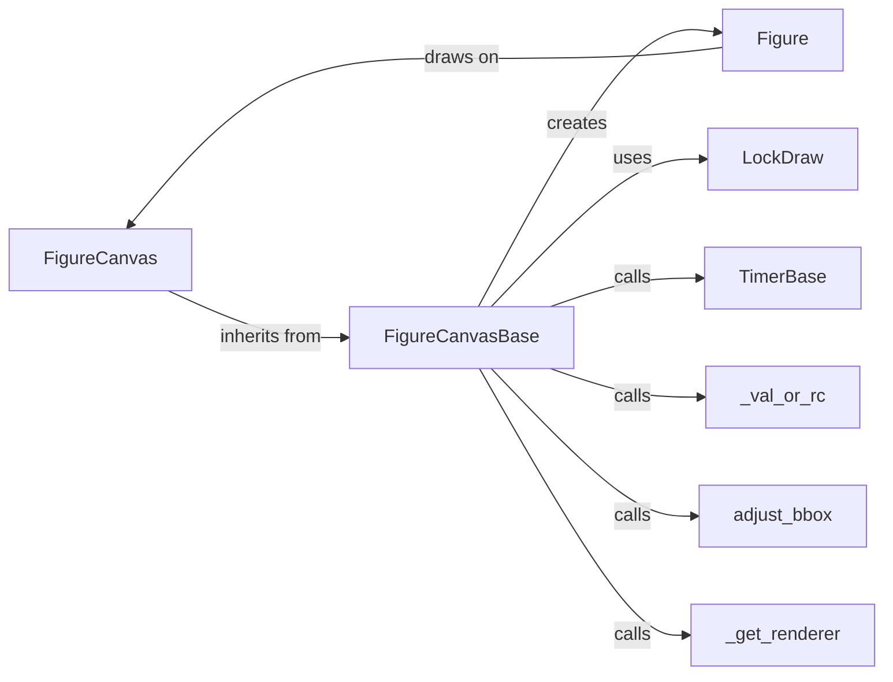

## Component Details

The matplotlib rendering pipeline centers around the `FigureCanvas`, which serves as the interface to drawing surfaces. The `FigureCanvasBase` provides the foundation, defining the core methods for drawing and event handling. Concrete `FigureCanvas` implementations (e.g., for PNG, SVG, or interactive backends) inherit from `FigureCanvasBase` and implement backend-specific drawing logic. The `Figure` object encapsulates the entire plot, containing axes, artists, and other elements. When `Figure.draw` is called, it triggers the rendering process on the associated `FigureCanvas`. Thread safety during rendering is ensured by the `LockDraw` context manager. Timers, managed by `TimerBase`, enable animations and dynamic updates. Helper functions like `_get_renderer` retrieve the renderer for a figure, while `adjust_bbox` optimizes the figure's bounding box. The rendering process also interacts with matplotlib's configuration system via `_val_or_rc`.

### FigureCanvas
The FigureCanvas component represents the drawing surface onto which the figure is rendered. It is backend-specific, meaning its implementation varies depending on the output format (e.g., PNG, SVG, PDF, or interactive display). The FigureCanvas handles the actual drawing of the figure and manages events such as resizing and user interactions.
**Related Classes/Methods**:

- <a href="https://github.com/matplotlib/matplotlib/blob/master/lib/matplotlib/backend_bases.py#L1675-L2388" target="_blank" rel="noopener noreferrer">`lib.matplotlib.backend_bases.FigureCanvasBase` (1675:2388)</a>

### FigureCanvasBase
FigureCanvasBase is an abstract base class that defines the interface for all FigureCanvas implementations. It provides methods for drawing the figure, handling events, and managing timers. It also includes functionality for printing the figure to a file.
**Related Classes/Methods**:

- <a href="https://github.com/matplotlib/matplotlib/blob/master/lib/matplotlib/backend_bases.py#L1675-L2388" target="_blank" rel="noopener noreferrer">`matplotlib.lib.matplotlib.backend_bases.FigureCanvasBase` (1675:2388)</a>
- <a href="https://github.com/matplotlib/matplotlib/blob/master/lib/matplotlib/backend_bases.py#L1723-L1742" target="_blank" rel="noopener noreferrer">`matplotlib.lib.matplotlib.backend_bases.FigureCanvasBase.__init__` (1723:1742)</a>
- <a href="https://github.com/matplotlib/matplotlib/blob/master/lib/matplotlib/backend_bases.py#L1750-L1784" target="_blank" rel="noopener noreferrer">`matplotlib.lib.matplotlib.backend_bases.FigureCanvasBase._fix_ipython_backend2gui` (1750:1784)</a>
- <a href="https://github.com/matplotlib/matplotlib/blob/master/lib/matplotlib/backend_bases.py#L1817-L1839" target="_blank" rel="noopener noreferrer">`matplotlib.lib.matplotlib.backend_bases.FigureCanvasBase:inaxes` (1817:1839)</a>
- <a href="https://github.com/matplotlib/matplotlib/blob/master/lib/matplotlib/backend_bases.py#L1890-L1905" target="_blank" rel="noopener noreferrer">`matplotlib.lib.matplotlib.backend_bases.FigureCanvasBase:draw_idle` (1890:1905)</a>
- <a href="https://github.com/matplotlib/matplotlib/blob/master/lib/matplotlib/backend_bases.py#L2002-L2061" target="_blank" rel="noopener noreferrer">`matplotlib.lib.matplotlib.backend_bases.FigureCanvasBase:_switch_canvas_and_return_print_method` (2002:2061)</a>
- <a href="https://github.com/matplotlib/matplotlib/blob/master/lib/matplotlib/backend_bases.py#L2063-L2208" target="_blank" rel="noopener noreferrer">`matplotlib.lib.matplotlib.backend_bases.FigureCanvasBase:print_figure` (2063:2208)</a>
- <a href="https://github.com/matplotlib/matplotlib/blob/master/lib/matplotlib/backend_bases.py#L2221-L2238" target="_blank" rel="noopener noreferrer">`matplotlib.lib.matplotlib.backend_bases.FigureCanvasBase.get_default_filename` (2221:2238)</a>
- <a href="https://github.com/matplotlib/matplotlib/blob/master/lib/matplotlib/backend_bases.py#L2321-L2344" target="_blank" rel="noopener noreferrer">`matplotlib.lib.matplotlib.backend_bases.FigureCanvasBase:new_timer` (2321:2344)</a>
- <a href="https://github.com/matplotlib/matplotlib/blob/master/lib/matplotlib/backend_bases.py#L2353-L2379" target="_blank" rel="noopener noreferrer">`matplotlib.lib.matplotlib.backend_bases.FigureCanvasBase:start_event_loop` (2353:2379)</a>

### Figure
The Figure class represents the entire figure, including all axes, artists, and other elements. It provides methods for creating and managing these elements, as well as for saving the figure to a file.
**Related Classes/Methods**:

- <a href="https://github.com/matplotlib/matplotlib/blob/master/lib/matplotlib/figure.py#L2424-L3644" target="_blank" rel="noopener noreferrer">`matplotlib.figure.Figure` (2424:3644)</a>

### LockDraw
LockDraw is a context manager that prevents multiple threads from drawing to the canvas simultaneously, ensuring thread safety.
**Related Classes/Methods**:

- <a href="https://github.com/matplotlib/matplotlib/blob/master/lib/matplotlib/widgets.py#L28-L63" target="_blank" rel="noopener noreferrer">`matplotlib.widgets.LockDraw` (28:63)</a>

### TimerBase
TimerBase is an abstract base class for implementing timers that trigger events at regular intervals. It is used for animations and other dynamic updates.
**Related Classes/Methods**:

- <a href="https://github.com/matplotlib/matplotlib/blob/master/lib/matplotlib/backend_bases.py#L1022-L1176" target="_blank" rel="noopener noreferrer">`matplotlib.lib.matplotlib.backend_bases.TimerBase` (1022:1176)</a>

### _get_renderer
This function retrieves the renderer for a given figure.
**Related Classes/Methods**:

- <a href="https://github.com/matplotlib/matplotlib/blob/master/lib/matplotlib/backend_bases.py#L1565-L1594" target="_blank" rel="noopener noreferrer">`matplotlib.lib.matplotlib.backend_bases._get_renderer` (1565:1594)</a>

### adjust_bbox
This function adjusts the bounding box of a figure to remove extra whitespace.
**Related Classes/Methods**:

- <a href="https://github.com/matplotlib/matplotlib/blob/master/lib/matplotlib/_tight_bbox.py#L8-L70" target="_blank" rel="noopener noreferrer">`matplotlib._tight_bbox.adjust_bbox` (8:70)</a>
- <a href="https://github.com/matplotlib/matplotlib/blob/master/lib/matplotlib/_tight_bbox.py#L39-L52" target="_blank" rel="noopener noreferrer">`matplotlib._tight_bbox.adjust_bbox.restore_bbox` (39:52)</a>

### _val_or_rc
This function retrieves a value or falls back to a default from the matplotlib rc parameters.
**Related Classes/Methods**:

- <a href="https://github.com/matplotlib/matplotlib/blob/master/.circleci/fetch_doc_logs.py#LNone-LNone" target="_blank" rel="noopener noreferrer">`matplotlib._val_or_rc` (full file reference)</a>