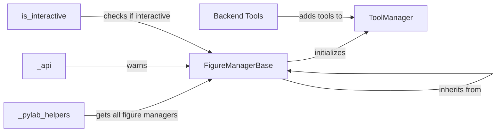

## Component Details

The FigureManager component in Matplotlib is responsible for managing the interface between a Figure and its corresponding backend, providing a user interface for interacting with the plot. It handles the creation of the window or widget that displays the figure, manages the toolbar for interactive plot manipulation (zooming, panning, saving), and processes user events like key presses and mouse clicks. The FigureManager relies on the FigureManagerBase for the basic management and ToolManager for managing interactive tools.

### FigureManagerBase
FigureManagerBase serves as an abstract base class for backend-specific FigureManagers. It provides core functionalities such as setting the window title, managing the figure canvas, and handling show events. Subclasses implement the specific details for different backends.
**Related Classes/Methods**:

- <a href="https://github.com/matplotlib/matplotlib/blob/master/lib/matplotlib/backend_bases.py#L2556-L2761" target="_blank" rel="noopener noreferrer">`matplotlib.backend_bases.FigureManagerBase` (2556:2761)</a>
- <a href="https://github.com/matplotlib/matplotlib/blob/master/lib/matplotlib/backend_bases.py#L2622-L2657" target="_blank" rel="noopener noreferrer">`matplotlib.backend_bases.FigureManagerBase.__init__` (2622:2657)</a>
- <a href="https://github.com/matplotlib/matplotlib/blob/master/lib/matplotlib/backend_bases.py#L2747-L2761" target="_blank" rel="noopener noreferrer">`matplotlib.backend_bases.FigureManagerBase.set_window_title` (2747:2761)</a>
- <a href="https://github.com/matplotlib/matplotlib/blob/master/lib/matplotlib/backend_bases.py#L2682-L2714" target="_blank" rel="noopener noreferrer">`matplotlib.backend_bases.FigureManagerBase.pyplot_show` (2682:2714)</a>
- <a href="https://github.com/matplotlib/matplotlib/blob/master/lib/matplotlib/backend_bases.py#L2716-L2732" target="_blank" rel="noopener noreferrer">`matplotlib.backend_bases.FigureManagerBase.show` (2716:2732)</a>
- <a href="https://github.com/matplotlib/matplotlib/blob/master/lib/matplotlib/backend_bases.py#L2660-L2667" target="_blank" rel="noopener noreferrer">`matplotlib.backend_bases.FigureManagerBase.create_with_canvas` (2660:2667)</a>
- <a href="https://github.com/matplotlib/matplotlib/blob/master/lib/matplotlib/backend_bases.py#L2551-L2553" target="_blank" rel="noopener noreferrer">`matplotlib.backend_bases.NonGuiException` (2551:2553)</a>

### ToolManager
The ToolManager is responsible for managing interactive tools associated with a figure, such as zoom, pan, and save. It provides a centralized interface for accessing and controlling these tools, allowing users to interact with the plot.
**Related Classes/Methods**:

- <a href="https://github.com/matplotlib/matplotlib/blob/master/lib/matplotlib/backend_managers.py#L32-L387" target="_blank" rel="noopener noreferrer">`matplotlib.backend_managers.ToolManager` (32:387)</a>

### Backend Tools
The Backend Tools module provides functions for adding pre-defined tools to the ToolManager and containers. These tools enhance the interactive capabilities of the figure, providing functionalities like zooming, panning, and saving the plot.
**Related Classes/Methods**:

- <a href="https://github.com/matplotlib/matplotlib/blob/master/lib/matplotlib/backend_tools.py#L964-L978" target="_blank" rel="noopener noreferrer">`matplotlib.backend_tools.add_tools_to_manager` (964:978)</a>
- <a href="https://github.com/matplotlib/matplotlib/blob/master/lib/matplotlib/backend_tools.py#L981-L998" target="_blank" rel="noopener noreferrer">`matplotlib.backend_tools.add_tools_to_container` (981:998)</a>

### _pylab_helpers
The _pylab_helpers module provides helper functions for managing figures and their managers, particularly within the pyplot interface. It assists in tracking and retrieving all existing figure managers.
**Related Classes/Methods**:

- <a href="https://github.com/matplotlib/matplotlib/blob/master/lib/matplotlib/_pylab_helpers.py#L90-L92" target="_blank" rel="noopener noreferrer">`matplotlib._pylab_helpers.Gcf.get_all_fig_managers` (90:92)</a>

### _api
The _api module provides internal API functionalities, including warning mechanisms. It's used for issuing warnings related to external or deprecated features.
**Related Classes/Methods**:

- <a href="https://github.com/matplotlib/matplotlib/blob/master/lib/matplotlib/_api/deprecation.py#LNone-LNone" target="_blank" rel="noopener noreferrer">`matplotlib._api.warn_external` (full file reference)</a>

### is_interactive
The `is_interactive` function determines whether Matplotlib is currently in interactive mode. This mode affects how figures are displayed and updated.
**Related Classes/Methods**:

- <a href="https://github.com/matplotlib/matplotlib/blob/master/.circleci/fetch_doc_logs.py#LNone-LNone" target="_blank" rel="noopener noreferrer">`matplotlib.is_interactive` (full file reference)</a>