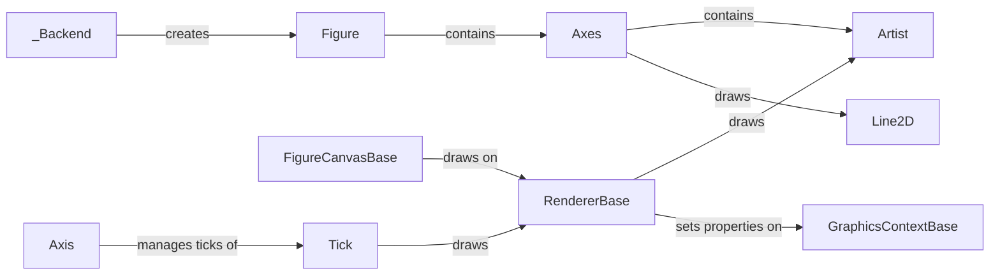

## Component Details

The Matplotlib plotting library provides a comprehensive set of tools for creating static, interactive, and animated visualizations in Python. The core components work together to define the structure of a plot, manage the data being plotted, render the plot to a specific backend, and handle user interactions. The process begins with creating a Figure, which serves as the top-level container for the plot. Axes objects are then added to the Figure to define the coordinate system and contain the data. Artists, such as Line2D objects, represent the data being plotted. The RendererBase and GraphicsContextBase classes handle the actual drawing of the plot on a backend-specific canvas, managed by FigureCanvasBase. User interactions are handled by FigureManagerBase and NavigationToolbar2, which provide a user interface for navigating and manipulating the plot. Events are used to communicate between the GUI and the Matplotlib library. The _Backend class is responsible for creating the figure manager and drawing the figure.

### Figure
The Figure is the top-level container for all plot elements. It encapsulates one or more Axes, as well as other Artists such as legends and titles. It provides methods for creating, managing, and saving plots.
**Related Classes/Methods**:

- <a href="https://github.com/matplotlib/matplotlib/blob/master/lib/matplotlib/pyplot.py#L874-L1079" target="_blank" rel="noopener noreferrer">`lib.matplotlib.pyplot:figure` (874:1079)</a>

### Axes
The Axes object defines the coordinate system and contains the data being plotted. It manages the Axis objects (XAxis and YAxis), which define the scales and ticks. It also contains the Artists that represent the data, such as lines, scatter plots, and images.
**Related Classes/Methods**:

- <a href="https://github.com/matplotlib/matplotlib/blob/master/lib/matplotlib/axis.py#L599-L654" target="_blank" rel="noopener noreferrer">`lib.matplotlib.axis.Axis:__init__` (599:654)</a>
- <a href="https://github.com/matplotlib/matplotlib/blob/master/lib/matplotlib/axis.py#L2368-L2370" target="_blank" rel="noopener noreferrer">`lib.matplotlib.axis.XAxis:__init__` (2368:2370)</a>
- <a href="https://github.com/matplotlib/matplotlib/blob/master/lib/matplotlib/axis.py#L2592-L2594" target="_blank" rel="noopener noreferrer">`lib.matplotlib.axis.YAxis:__init__` (2592:2594)</a>

### Artist
The Artist class is the base class for all drawable objects in Matplotlib. It provides common functionalities such as managing visibility, picking, and removing objects from the figure. It interacts with the `Figure` object to access the canvas and other artists to manage the scene.
**Related Classes/Methods**:

- <a href="https://github.com/matplotlib/matplotlib/blob/master/lib/matplotlib/artist.py#L214-L250" target="_blank" rel="noopener noreferrer">`lib.matplotlib.artist.Artist:remove` (214:250)</a>
- <a href="https://github.com/matplotlib/matplotlib/blob/master/lib/matplotlib/artist.py#L464-L480" target="_blank" rel="noopener noreferrer">`lib.matplotlib.artist.Artist:_different_canvas` (464:480)</a>
- <a href="https://github.com/matplotlib/matplotlib/blob/master/lib/matplotlib/artist.py#L502-L510" target="_blank" rel="noopener noreferrer">`lib.matplotlib.artist.Artist:pickable` (502:510)</a>
- <a href="https://github.com/matplotlib/matplotlib/blob/master/lib/matplotlib/artist.py#L512-L548" target="_blank" rel="noopener noreferrer">`lib.matplotlib.artist.Artist:pick` (512:548)</a>

### Line2D
The Line2D class represents a line on a plot. It is an Artist that connects a series of points with a line. It interacts with the Axes to determine its position and with the RendererBase to draw the line.
**Related Classes/Methods**:

- <a href="https://github.com/matplotlib/matplotlib/blob/master/lib/matplotlib/pyplot.py#L3839-L3852" target="_blank" rel="noopener noreferrer">`lib.matplotlib.pyplot:plot` (3839:3852)</a>

### RendererBase
The RendererBase class is an abstract base class for renderers. It provides the basic interface for drawing primitives such as lines, paths, and text. It interacts with `GraphicsContextBase` to set the drawing properties and with the backend-specific canvas to perform the actual drawing.
**Related Classes/Methods**:

- <a href="https://github.com/matplotlib/matplotlib/blob/master/lib/matplotlib/backend_bases.py#L177-L206" target="_blank" rel="noopener noreferrer">`lib.matplotlib.backend_bases.RendererBase:draw_markers` (177:206)</a>
- <a href="https://github.com/matplotlib/matplotlib/blob/master/lib/matplotlib/backend_bases.py#L208-L257" target="_blank" rel="noopener noreferrer">`lib.matplotlib.backend_bases.RendererBase:draw_path_collection` (208:257)</a>
- <a href="https://github.com/matplotlib/matplotlib/blob/master/lib/matplotlib/backend_bases.py#L259-L278" target="_blank" rel="noopener noreferrer">`lib.matplotlib.backend_bases.RendererBase:draw_quad_mesh` (259:278)</a>
- <a href="https://github.com/matplotlib/matplotlib/blob/master/lib/matplotlib/backend_bases.py#L298-L325" target="_blank" rel="noopener noreferrer">`lib.matplotlib.backend_bases.RendererBase:_iter_collection_raw_paths` (298:325)</a>
- <a href="https://github.com/matplotlib/matplotlib/blob/master/lib/matplotlib/backend_bases.py#L344-L424" target="_blank" rel="noopener noreferrer">`lib.matplotlib.backend_bases.RendererBase:_iter_collection` (344:424)</a>
- <a href="https://github.com/matplotlib/matplotlib/blob/master/lib/matplotlib/backend_bases.py#L484-L505" target="_blank" rel="noopener noreferrer">`lib.matplotlib.backend_bases.RendererBase:draw_tex` (484:505)</a>
- <a href="https://github.com/matplotlib/matplotlib/blob/master/lib/matplotlib/backend_bases.py#L507-L539" target="_blank" rel="noopener noreferrer">`lib.matplotlib.backend_bases.RendererBase:draw_text` (507:539)</a>
- <a href="https://github.com/matplotlib/matplotlib/blob/master/lib/matplotlib/backend_bases.py#L541-L566" target="_blank" rel="noopener noreferrer">`lib.matplotlib.backend_bases.RendererBase:_draw_text_as_path` (541:566)</a>
- <a href="https://github.com/matplotlib/matplotlib/blob/master/lib/matplotlib/backend_bases.py#L568-L597" target="_blank" rel="noopener noreferrer">`lib.matplotlib.backend_bases.RendererBase:get_text_width_height_descent` (568:597)</a>
- <a href="https://github.com/matplotlib/matplotlib/blob/master/lib/matplotlib/backend_bases.py#L611-L615" target="_blank" rel="noopener noreferrer">`lib.matplotlib.backend_bases.RendererBase:get_texmanager` (611:615)</a>
- <a href="https://github.com/matplotlib/matplotlib/blob/master/lib/matplotlib/backend_bases.py#L617-L619" target="_blank" rel="noopener noreferrer">`lib.matplotlib.backend_bases.RendererBase:new_gc` (617:619)</a>

### FigureCanvasBase
The `FigureCanvasBase` class is an abstract base class for figure canvases. It provides the basic interface for drawing a Matplotlib figure on a backend-specific canvas. It interacts with the `Figure` object to get the drawing commands and with the `RendererBase` to perform the actual drawing. It also handles events such as mouse clicks and key presses.
**Related Classes/Methods**:

- <a href="https://github.com/matplotlib/matplotlib/blob/master/lib/matplotlib/backend_bases.py#L1723-L1742" target="_blank" rel="noopener noreferrer">`lib.matplotlib.backend_bases.FigureCanvasBase:__init__` (1723:1742)</a>
- <a href="https://github.com/matplotlib/matplotlib/blob/master/lib/matplotlib/backend_bases.py#L1750-L1784" target="_blank" rel="noopener noreferrer">`lib.matplotlib.backend_bases.FigureCanvasBase:_fix_ipython_backend2gui` (1750:1784)</a>
- <a href="https://github.com/matplotlib/matplotlib/blob/master/lib/matplotlib/backend_bases.py#L1817-L1839" target="_blank" rel="noopener noreferrer">`lib.matplotlib.backend_bases.FigureCanvasBase:inaxes` (1817:1839)</a>
- <a href="https://github.com/matplotlib/matplotlib/blob/master/lib/matplotlib/backend_bases.py#L1890-L1905" target="_blank" rel="noopener noreferrer">`lib.matplotlib.backend_bases.FigureCanvasBase:draw_idle` (1890:1905)</a>
- <a href="https://github.com/matplotlib/matplotlib/blob/master/lib/matplotlib/backend_bases.py#L2002-L2061" target="_blank" rel="noopener noreferrer">`lib.matplotlib.backend_bases.FigureCanvasBase:_switch_canvas_and_return_print_method` (2002:2061)</a>
- <a href="https://github.com/matplotlib/matplotlib/blob/master/lib/matplotlib/backend_bases.py#L2063-L2208" target="_blank" rel="noopener noreferrer">`lib.matplotlib.backend_bases.FigureCanvasBase:print_figure` (2063:2208)</a>
- <a href="https://github.com/matplotlib/matplotlib/blob/master/lib/matplotlib/backend_bases.py#L2221-L2238" target="_blank" rel="noopener noreferrer">`lib.matplotlib.backend_bases.FigureCanvasBase:get_default_filename` (2221:2238)</a>
- <a href="https://github.com/matplotlib/matplotlib/blob/master/lib/matplotlib/backend_bases.py#L2321-L2344" target="_blank" rel="noopener noreferrer">`lib.matplotlib.backend_bases.FigureCanvasBase:new_timer` (2321:2344)</a>
- <a href="https://github.com/matplotlib/matplotlib/blob/master/lib/matplotlib/backend_bases.py#L2353-L2379" target="_blank" rel="noopener noreferrer">`lib.matplotlib.backend_bases.FigureCanvasBase:start_event_loop` (2353:2379)</a>

### GraphicsContextBase
The `GraphicsContextBase` class is an abstract base class for graphics contexts. It stores the drawing properties such as color, linewidth, and linestyle. It interacts with the `RendererBase` to set the drawing properties on the backend-specific canvas.
**Related Classes/Methods**:

- <a href="https://github.com/matplotlib/matplotlib/blob/master/lib/matplotlib/backend_bases.py#L825-L840" target="_blank" rel="noopener noreferrer">`lib.matplotlib.backend_bases.GraphicsContextBase:set_alpha` (825:840)</a>
- <a href="https://github.com/matplotlib/matplotlib/blob/master/lib/matplotlib/backend_bases.py#L848-L856" target="_blank" rel="noopener noreferrer">`lib.matplotlib.backend_bases.GraphicsContextBase:set_capstyle` (848:856)</a>
- <a href="https://github.com/matplotlib/matplotlib/blob/master/lib/matplotlib/backend_bases.py#L862-L865" target="_blank" rel="noopener noreferrer">`lib.matplotlib.backend_bases.GraphicsContextBase:set_clip_path` (862:865)</a>
- <a href="https://github.com/matplotlib/matplotlib/blob/master/lib/matplotlib/backend_bases.py#L897-L915" target="_blank" rel="noopener noreferrer">`lib.matplotlib.backend_bases.GraphicsContextBase:set_foreground` (897:915)</a>
- <a href="https://github.com/matplotlib/matplotlib/blob/master/lib/matplotlib/backend_bases.py#L918-L926" target="_blank" rel="noopener noreferrer">`lib.matplotlib.backend_bases.GraphicsContextBase:set_joinstyle` (918:926)</a>
- <a href="https://github.com/matplotlib/matplotlib/blob/master/lib/matplotlib/backend_bases.py#L959-L964" target="_blank" rel="noopener noreferrer">`lib.matplotlib.backend_bases.GraphicsContextBase:get_hatch_path` (959:964)</a>

### Axis
The `Axis` class manages the axis ticks, labels, and gridlines in a Matplotlib plot. It handles the positioning and formatting of these elements and interacts with `Tick` objects to draw individual ticks and labels. It also interacts with locators and formatters to determine the tick locations and formats.
**Related Classes/Methods**:

- <a href="https://github.com/matplotlib/matplotlib/blob/master/lib/matplotlib/axis.py#L816-L818" target="_blank" rel="noopener noreferrer">`lib.matplotlib.axis.Axis:get_children` (816:818)</a>
- <a href="https://github.com/matplotlib/matplotlib/blob/master/lib/matplotlib/axis.py#L832-L873" target="_blank" rel="noopener noreferrer">`lib.matplotlib.axis.Axis:clear` (832:873)</a>
- <a href="https://github.com/matplotlib/matplotlib/blob/master/lib/matplotlib/axis.py#L933-L976" target="_blank" rel="noopener noreferrer">`lib.matplotlib.axis.Axis:set_tick_params` (933:976)</a>
- <a href="https://github.com/matplotlib/matplotlib/blob/master/lib/matplotlib/axis.py#L1385-L1407" target="_blank" rel="noopener noreferrer">`lib.matplotlib.axis.Axis:draw` (1385:1407)</a>
- <a href="https://github.com/matplotlib/matplotlib/blob/master/lib/matplotlib/axis.py#L1409-L1413" target="_blank" rel="noopener noreferrer">`lib.matplotlib.axis.Axis:get_gridlines` (1409:1413)</a>
- <a href="https://github.com/matplotlib/matplotlib/blob/master/lib/matplotlib/axis.py#L1440-L1446" target="_blank" rel="noopener noreferrer">`lib.matplotlib.axis.Axis:get_majorticklabels` (1440:1446)</a>
- <a href="https://github.com/matplotlib/matplotlib/blob/master/lib/matplotlib/axis.py#L1448-L1454" target="_blank" rel="noopener noreferrer">`lib.matplotlib.axis.Axis:get_minorticklabels` (1448:1454)</a>
- <a href="https://github.com/matplotlib/matplotlib/blob/master/lib/matplotlib/axis.py#L1456-L1485" target="_blank" rel="noopener noreferrer">`lib.matplotlib.axis.Axis:get_ticklabels` (1456:1485)</a>
- <a href="https://github.com/matplotlib/matplotlib/blob/master/lib/matplotlib/axis.py#L1487-L1494" target="_blank" rel="noopener noreferrer">`lib.matplotlib.axis.Axis:get_majorticklines` (1487:1494)</a>
- <a href="https://github.com/matplotlib/matplotlib/blob/master/lib/matplotlib/axis.py#L1496-L1503" target="_blank" rel="noopener noreferrer">`lib.matplotlib.axis.Axis:get_minorticklines` (1496:1503)</a>
- <a href="https://github.com/matplotlib/matplotlib/blob/master/lib/matplotlib/axis.py#L1505-L1509" target="_blank" rel="noopener noreferrer">`lib.matplotlib.axis.Axis:get_ticklines` (1505:1509)</a>
- <a href="https://github.com/matplotlib/matplotlib/blob/master/lib/matplotlib/axis.py#L1632-L1656" target="_blank" rel="noopener noreferrer">`lib.matplotlib.axis.Axis:get_major_ticks` (1632:1656)</a>
- <a href="https://github.com/matplotlib/matplotlib/blob/master/lib/matplotlib/axis.py#L1658-L1682" target="_blank" rel="noopener noreferrer">`lib.matplotlib.axis.Axis:get_minor_ticks` (1658:1682)</a>
- <a href="https://github.com/matplotlib/matplotlib/blob/master/lib/matplotlib/axis.py#L1684-L1724" target="_blank" rel="noopener noreferrer">`lib.matplotlib.axis.Axis:grid` (1684:1724)</a>
- <a href="https://github.com/matplotlib/matplotlib/blob/master/lib/matplotlib/axis.py#L1866-L1892" target="_blank" rel="noopener noreferrer">`lib.matplotlib.axis.Axis:set_label_text` (1866:1892)</a>
- <a href="https://github.com/matplotlib/matplotlib/blob/master/lib/matplotlib/axis.py#L2015-L2141" target="_blank" rel="noopener noreferrer">`lib.matplotlib.axis.Axis:set_ticklabels` (2015:2141)</a>
- <a href="https://github.com/matplotlib/matplotlib/blob/master/lib/matplotlib/axis.py#L2249-L2264" target="_blank" rel="noopener noreferrer">`lib.matplotlib.axis.Axis:axis_date` (2249:2264)</a>
- <a href="https://github.com/matplotlib/matplotlib/blob/master/lib/matplotlib/axis.py#L2372-L2400" target="_blank" rel="noopener noreferrer">`lib.matplotlib.axis.XAxis:_init` (2372:2400)</a>
- <a href="https://github.com/matplotlib/matplotlib/blob/master/lib/matplotlib/axis.py#L2402-L2416" target="_blank" rel="noopener noreferrer">`lib.matplotlib.axis.XAxis:contains` (2402:2416)</a>
- <a href="https://github.com/matplotlib/matplotlib/blob/master/lib/matplotlib/axis.py#L2432-L2456" target="_blank" rel="noopener noreferrer">`lib.matplotlib.axis.XAxis:_update_label_position` (2432:2456)</a>
- <a href="https://github.com/matplotlib/matplotlib/blob/master/lib/matplotlib/axis.py#L2458-L2480" target="_blank" rel="noopener noreferrer">`lib.matplotlib.axis.XAxis:_update_offset_text_position` (2458:2480)</a>
- <a href="https://github.com/matplotlib/matplotlib/blob/master/lib/matplotlib/axis.py#L2482-L2519" target="_blank" rel="noopener noreferrer">`lib.matplotlib.axis.XAxis:set_ticks_position` (2482:2519)</a>
- <a href="https://github.com/matplotlib/matplotlib/blob/master/lib/matplotlib/axis.py#L2596-L2626" target="_blank" rel="noopener noreferrer">`lib.matplotlib.axis.YAxis:_init` (2596:2626)</a>
- <a href="https://github.com/matplotlib/matplotlib/blob/master/lib/matplotlib/axis.py#L2628-L2642" target="_blank" rel="noopener noreferrer">`lib.matplotlib.axis.YAxis:contains` (2628:2642)</a>
- <a href="https://github.com/matplotlib/matplotlib/blob/master/lib/matplotlib/axis.py#L2659-L2683" target="_blank" rel="noopener noreferrer">`lib.matplotlib.axis.YAxis:_update_label_position` (2659:2683)</a>
- <a href="https://github.com/matplotlib/matplotlib/blob/master/lib/matplotlib/axis.py#L2685-L2699" target="_blank" rel="noopener noreferrer">`lib.matplotlib.axis.YAxis:_update_offset_text_position` (2685:2699)</a>
- <a href="https://github.com/matplotlib/matplotlib/blob/master/lib/matplotlib/axis.py#L2701-L2712" target="_blank" rel="noopener noreferrer">`lib.matplotlib.axis.YAxis:set_offset_position` (2701:2712)</a>
- <a href="https://github.com/matplotlib/matplotlib/blob/master/lib/matplotlib/axis.py#L2714-L2747" target="_blank" rel="noopener noreferrer">`lib.matplotlib.axis.YAxis:set_ticks_position` (2714:2747)</a>

### Tick
The `Tick` class represents a single tick mark on an axis. It manages the tick line, label, and gridline. It interacts with the `Axis` object to get its properties and with the `RendererBase` to draw the tick mark. It also uses `Line2D` and `Text` objects to draw the tick line and label.
**Related Classes/Methods**:

- <a href="https://github.com/matplotlib/matplotlib/blob/master/lib/matplotlib/axis.py#L60-L175" target="_blank" rel="noopener noreferrer">`lib.matplotlib.axis.Tick:__init__` (60:175)</a>
- <a href="https://github.com/matplotlib/matplotlib/blob/master/lib/matplotlib/axis.py#L220-L224" target="_blank" rel="noopener noreferrer">`lib.matplotlib.axis.Tick:set_clip_path` (220:224)</a>
- <a href="https://github.com/matplotlib/matplotlib/blob/master/lib/matplotlib/axis.py#L255-L264" target="_blank" rel="noopener noreferrer">`lib.matplotlib.axis.Tick:draw` (255:264)</a>
- <a href="https://github.com/matplotlib/matplotlib/blob/master/lib/matplotlib/axis.py#L266-L277" target="_blank" rel="noopener noreferrer">`lib.matplotlib.axis.Tick:set_url` (266:277)</a>
- <a href="https://github.com/matplotlib/matplotlib/blob/master/lib/matplotlib/axis.py#L279-L280" target="_blank" rel="noopener noreferrer">`lib.matplotlib.axis.Tick:_set_artist_props` (279:280)</a>
- <a href="https://github.com/matplotlib/matplotlib/blob/master/lib/matplotlib/axis.py#L354-L374" target="_blank" rel="noopener noreferrer">`lib.matplotlib.axis.XTick:__init__` (354:374)</a>
- <a href="https://github.com/matplotlib/matplotlib/blob/master/lib/matplotlib/axis.py#L415-L435" target="_blank" rel="noopener noreferrer">`lib.matplotlib.axis.YTick:__init__` (415:435)</a>

### _Backend
The `_Backend` class is an abstract base class for backends. It provides the basic interface for creating a figure manager and drawing the figure. It interacts with the `FigureManagerBase` and `FigureCanvasBase` to create the window and draw the figure.
**Related Classes/Methods**:

- <a href="https://github.com/matplotlib/matplotlib/blob/master/lib/matplotlib/backend_bases.py#L3527-L3533" target="_blank" rel="noopener noreferrer">`lib.matplotlib.backend_bases._Backend:new_figure_manager` (3527:3533)</a>
- <a href="https://github.com/matplotlib/matplotlib/blob/master/lib/matplotlib/backend_bases.py#L3541-L3550" target="_blank" rel="noopener noreferrer">`lib.matplotlib.backend_bases._Backend:draw_if_interactive` (3541:3550)</a>
- <a href="https://github.com/matplotlib/matplotlib/blob/master/lib/matplotlib/backend_bases.py#L3553-L3579" target="_blank" rel="noopener noreferrer">`lib.matplotlib.backend_bases._Backend:show` (3553:3579)</a>
- <a href="https://github.com/matplotlib/matplotlib/blob/master/lib/matplotlib/pyplot.py#L572-L617" target="_blank" rel="noopener noreferrer">`lib.matplotlib.pyplot:show` (572:617)</a>