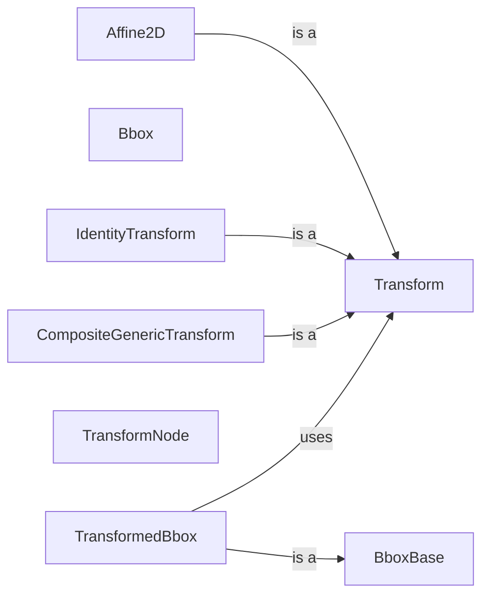

## Component Details

The Transforms component in Matplotlib is responsible for managing coordinate transformations between different coordinate systems, such as data space, axes space, and display space. It provides a flexible and extensible framework for mapping data coordinates to display coordinates, ensuring that plots are rendered correctly regardless of the data's scale, orientation, or position. The core of the component is the `Transform` class, which serves as the base class for all transformations. Subclasses of `Transform` implement specific transformation types, such as affine transformations, which include scaling, rotation, translation, and shearing. These transformations are used to position and orient artists within a plot. The `Bbox` class represents a bounding box and is used to define the extent of objects in different coordinate spaces. The Transforms component also includes classes for combining and manipulating transformations, such as `TransformNode` and `CompositeGenericTransform`, which allow for the creation of complex transformation pipelines.

### Transform
The base class for all transformations in Matplotlib. It defines the interface for transforming points and provides methods for creating inverse transformations. It is an abstract class that is subclassed to implement specific transformation types.
**Related Classes/Methods**:

- <a href="https://github.com/matplotlib/matplotlib/blob/master/lib/matplotlib/transforms.py#L1298-L1707" target="_blank" rel="noopener noreferrer">`matplotlib.transforms.Transform` (1298:1707)</a>

### Affine2D
Represents an affine transformation in 2D space. It is a subclass of `Transform` and provides methods for creating and manipulating affine transformations, such as scaling, rotation, translation, and shearing. It is used extensively for positioning and orienting artists in Matplotlib plots.
**Related Classes/Methods**:

- <a href="https://github.com/matplotlib/matplotlib/blob/master/lib/matplotlib/transforms.py#L1906-L2125" target="_blank" rel="noopener noreferrer">`matplotlib.transforms.Affine2D` (1906:2125)</a>

### Bbox
Represents a bounding box, defining the extent of an object in data or display space. It provides methods for calculating the width, height, and area of the bounding box, as well as for intersecting and containing other bounding boxes.
**Related Classes/Methods**:

- <a href="https://github.com/matplotlib/matplotlib/blob/master/lib/matplotlib/transforms.py#L670-L1099" target="_blank" rel="noopener noreferrer">`matplotlib.transforms.Bbox` (670:1099)</a>

### BboxBase
Abstract base class for Bbox objects, defining the basic interface for bounding boxes.
**Related Classes/Methods**:

- <a href="https://github.com/matplotlib/matplotlib/blob/master/lib/matplotlib/transforms.py#L207-L664" target="_blank" rel="noopener noreferrer">`matplotlib.transforms.BboxBase` (207:664)</a>

### TransformedBbox
Represents a bounding box that is transformed by a given transformation. It is useful for keeping track of the bounding box of an object as it is transformed.
**Related Classes/Methods**:

- <a href="https://github.com/matplotlib/matplotlib/blob/master/lib/matplotlib/transforms.py#L1102-L1174" target="_blank" rel="noopener noreferrer">`matplotlib.transforms.TransformedBbox` (1102:1174)</a>

### IdentityTransform
Represents the identity transformation, which does not change the coordinates of points. It is often used as a default transformation or as a base for more complex transformations.
**Related Classes/Methods**:

- <a href="https://github.com/matplotlib/matplotlib/blob/master/lib/matplotlib/transforms.py#L2128-L2175" target="_blank" rel="noopener noreferrer">`matplotlib.transforms.IdentityTransform` (2128:2175)</a>

### TransformNode
A node in a transformation graph, used to build up complex transformation pipelines.
**Related Classes/Methods**:

- <a href="https://github.com/matplotlib/matplotlib/blob/master/lib/matplotlib/transforms.py#L83-L204" target="_blank" rel="noopener noreferrer">`matplotlib.transforms.TransformNode` (83:204)</a>

### CompositeGenericTransform
A transform that combines two other transforms, allowing for the creation of more complex transformations.
**Related Classes/Methods**:

- <a href="https://github.com/matplotlib/matplotlib/blob/master/lib/matplotlib/transforms.py#L2356-L2467" target="_blank" rel="noopener noreferrer">`matplotlib.transforms.CompositeGenericTransform` (2356:2467)</a>