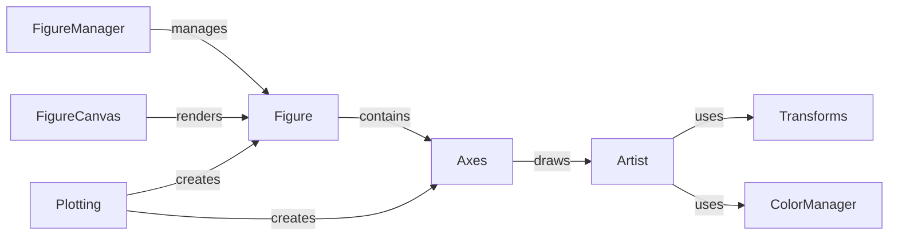

## Component Details

Matplotlib is a comprehensive library for creating static, interactive, and animated visualizations in Python. Its core functionality revolves around generating figures, populating them with various plot types and visual elements, and rendering them across different backends. The library's architecture is designed to be highly customizable, allowing users to fine-tune every aspect of their plots. The main flow involves creating a Figure, adding one or more Axes to it, plotting data on the Axes using various plotting functions, customizing the appearance of the plot, and finally rendering the Figure to a desired output format.

### FigureCanvas
The FigureCanvas component represents the drawing surface onto which the figure is rendered. It is backend-specific, meaning its implementation varies depending on the output format (e.g., PNG, SVG, PDF, or interactive display). The FigureCanvas handles the actual drawing of the figure and manages events such as resizing and user interactions.
**Related Classes/Methods**:

- <a href="https://github.com/matplotlib/matplotlib/blob/master/lib/matplotlib/backend_bases.py#L1675-L2388" target="_blank" rel="noopener noreferrer">`lib.matplotlib.backend_bases.FigureCanvasBase` (1675:2388)</a>

### FigureManager
The FigureManager component is responsible for managing the interface between the Figure and the backend. It creates the window or widget that displays the figure, provides a toolbar for interacting with the plot (e.g., zooming, panning, saving), and handles events such as key presses and mouse clicks. The FigureManager essentially provides the user interface for interacting with the matplotlib plot.
**Related Classes/Methods**:

- <a href="https://github.com/matplotlib/matplotlib/blob/master/lib/matplotlib/backend_bases.py#L2556-L2761" target="_blank" rel="noopener noreferrer">`lib.matplotlib.backend_bases.FigureManagerBase` (2556:2761)</a>

### Figure
The Figure component is the top-level container for all plot elements. It represents the entire image that will be rendered. It can contain one or more Axes, as well as other artists such as legends, titles, and annotations. The Figure manages the layout of its child elements and provides methods for saving the figure to a file.
**Related Classes/Methods**:

- <a href="https://github.com/matplotlib/matplotlib/blob/master/lib/matplotlib/figure.py#L2424-L3644" target="_blank" rel="noopener noreferrer">`lib.matplotlib.figure.Figure` (2424:3644)</a>

### Axes
The Axes component represents a single plot within a Figure. It contains the data, the axes (x and y), and all the artists that make up the plot, such as lines, markers, and text. The Axes provides methods for plotting data, setting axis limits, adding labels, and customizing the appearance of the plot.
**Related Classes/Methods**:

- <a href="https://github.com/matplotlib/matplotlib/blob/master/lib/matplotlib/axes/_axes.py#L68-L8855" target="_blank" rel="noopener noreferrer">`lib.matplotlib.axes.Axes` (68:8855)</a>

### Artist
The Artist component is the base class for all drawable objects in matplotlib. This includes everything from simple lines and markers to complex shapes and text. The Artist manages properties like visibility, transformations, and callbacks. It also handles the drawing of the object on the canvas.
**Related Classes/Methods**:

- <a href="https://github.com/matplotlib/matplotlib/blob/master/lib/matplotlib/artist.py#L110-L1395" target="_blank" rel="noopener noreferrer">`lib.matplotlib.artist.Artist` (110:1395)</a>

### Transforms
The Transforms component handles coordinate transformations. It includes classes for affine transformations, bounding boxes, and path transformations. It is used to map data coordinates to display coordinates, ensuring that the plot is displayed correctly regardless of the data's scale or orientation.
**Related Classes/Methods**:

- <a href="https://github.com/matplotlib/matplotlib/blob/master/lib/matplotlib/transforms.py#L1298-L1707" target="_blank" rel="noopener noreferrer">`lib.matplotlib.transforms.Transform` (1298:1707)</a>

### ColorManager
The ColorManager component deals with color handling, colormaps, and normalization. It includes classes for colormaps, color converters, and normalization functions. It is used to map data values to colors, allowing for visually appealing and informative plots.
**Related Classes/Methods**:

- <a href="https://github.com/matplotlib/matplotlib/blob/master/lib/matplotlib/colors.py#L703-L1056" target="_blank" rel="noopener noreferrer">`lib.matplotlib.colors.Colormap` (703:1056)</a>

### Plotting
The Plotting component provides a convenient interface for creating plots. It includes functions for creating figures, axes, and plot elements. It is the main entry point for most plotting tasks, offering a high-level API for generating visualizations with minimal code.
**Related Classes/Methods**:

- <a href="https://github.com/matplotlib/matplotlib/blob/master/lib/matplotlib/pyplot.py#L874-L1079" target="_blank" rel="noopener noreferrer">`lib.matplotlib.pyplot:figure` (874:1079)</a>
- <a href="https://github.com/matplotlib/matplotlib/blob/master/lib/matplotlib/pyplot.py#L3839-L3852" target="_blank" rel="noopener noreferrer">`lib.matplotlib.pyplot:plot` (3839:3852)</a>
- <a href="https://github.com/matplotlib/matplotlib/blob/master/lib/matplotlib/pyplot.py#L572-L617" target="_blank" rel="noopener noreferrer">`lib.matplotlib.pyplot:show` (572:617)</a>