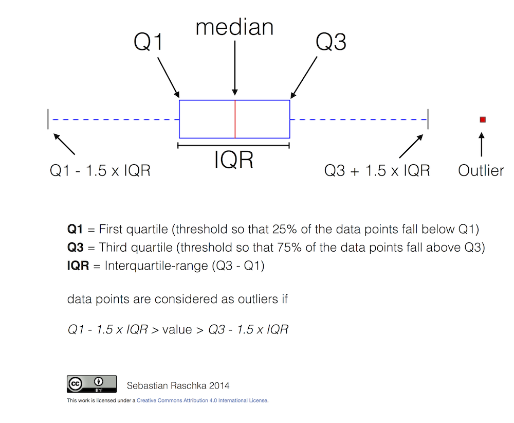

.. _howto-faq:

******
How-To
******

.. contents::
   :backlinks: none

.. _howto-plotting:

Plotting: howto
===============

.. _howto-datetime64:

Plot `numpy.datetime64` values
------------------------------

As of Matplotlib 2.2, `numpy.datetime64` objects are handled the same way
as `datetime.datetime` objects.

If you prefer the pandas converters and locators, you can register their
converter with the `matplolib.units` module::

  from pandas.tseries import converter as pdtc
  pdtc.register()

If you only want to use the `pandas` converter for `datetime64` values ::

  from pandas.tseries import converter as pdtc
  import matplotlib.units as munits
  import numpy as np

  munits.registry[np.datetime64] = pdtc.DatetimeConverter()

.. _howto-findobj:

Find all objects in a figure of a certain type
----------------------------------------------

Every Matplotlib artist (see :doc:`/tutorials/intermediate/artists`) has a method
called :meth:`~matplotlib.artist.Artist.findobj` that can be used to
recursively search the artist for any artists it may contain that meet
some criteria (e.g., match all :class:`~matplotlib.lines.Line2D`
instances or match some arbitrary filter function).  For example, the
following snippet finds every object in the figure which has a
`set_color` property and makes the object blue::

    def myfunc(x):
        return hasattr(x, 'set_color')

    for o in fig.findobj(myfunc):
        o.set_color('blue')

You can also filter on class instances::

    import matplotlib.text as text
    for o in fig.findobj(text.Text):
        o.set_fontstyle('italic')

.. _howto-supress_offset:

How to prevent ticklabels from having an offset
-----------------------------------------------
The default formatter will use an offset to reduce
the length of the ticklabels.  To turn this feature
off on a per-axis basis::

   ax.get_xaxis().get_major_formatter().set_useOffset(False)

set the rcParam ``axes.formatter.useoffset``, or use a different
formatter.  See :mod:`~matplotlib.ticker` for details.

.. _howto-transparent:

Save transparent figures
------------------------

The :meth:`~matplotlib.pyplot.savefig` command has a keyword argument
*transparent* which, if 'True', will make the figure and axes
backgrounds transparent when saving, but will not affect the displayed
image on the screen.

If you need finer grained control, e.g., you do not want full transparency
or you want to affect the screen displayed version as well, you can set
the alpha properties directly.  The figure has a
:class:`~matplotlib.patches.Rectangle` instance called *patch*
and the axes has a Rectangle instance called *patch*.  You can set
any property on them directly (*facecolor*, *edgecolor*, *linewidth*,
*linestyle*, *alpha*).  e.g.::

    fig = plt.figure()
    fig.patch.set_alpha(0.5)
    ax = fig.add_subplot(111)
    ax.patch.set_alpha(0.5)

If you need *all* the figure elements to be transparent, there is
currently no global alpha setting, but you can set the alpha channel
on individual elements, e.g.::

   ax.plot(x, y, alpha=0.5)
   ax.set_xlabel('volts', alpha=0.5)

.. _howto-multipage:

Save multiple plots to one pdf file
-----------------------------------

Many image file formats can only have one image per file, but some
formats support multi-page files. Currently only the pdf backend has
support for this. To make a multi-page pdf file, first initialize the
file::

    from matplotlib.backends.backend_pdf import PdfPages
    pp = PdfPages('multipage.pdf')

You can give the :class:`~matplotlib.backends.backend_pdf.PdfPages`
object to :func:`~matplotlib.pyplot.savefig`, but you have to specify
the format::

    plt.savefig(pp, format='pdf')

An easier way is to call
:meth:`PdfPages.savefig <matplotlib.backends.backend_pdf.PdfPages.savefig>`::

    pp.savefig()

Finally, the multipage pdf object has to be closed::

    pp.close()

The same can be done using the pgf backend::

    from matplotlib.backends.backend_pgf import PdfPages

.. _howto-subplots-adjust:

Move the edge of an axes to make room for tick labels
-----------------------------------------------------

For subplots, you can control the default spacing on the left, right,
bottom, and top as well as the horizontal and vertical spacing between
multiple rows and columns using the
:meth:`matplotlib.figure.Figure.subplots_adjust` method (in pyplot it
is :func:`~matplotlib.pyplot.subplots_adjust`).  For example, to move
the bottom of the subplots up to make room for some rotated x tick
labels::

    fig = plt.figure()
    fig.subplots_adjust(bottom=0.2)
    ax = fig.add_subplot(111)

You can control the defaults for these parameters in your
:file:`matplotlibrc` file; see :doc:`/tutorials/introductory/customizing`.  For
example, to make the above setting permanent, you would set::

    figure.subplot.bottom : 0.2   # the bottom of the subplots of the figure

The other parameters you can configure are, with their defaults

*left*  = 0.125
    the left side of the subplots of the figure
*right* = 0.9
    the right side of the subplots of the figure
*bottom* = 0.1
    the bottom of the subplots of the figure
*top* = 0.9
    the top of the subplots of the figure
*wspace* = 0.2
    the amount of width reserved for space between subplots,
    expressed as a fraction of the average axis width
*hspace* = 0.2
    the amount of height reserved for space between subplots,
    expressed as a fraction of the average axis height

If you want additional control, you can create an
:class:`~matplotlib.axes.Axes` using the
:func:`~matplotlib.pyplot.axes` command (or equivalently the figure
:meth:`~matplotlib.figure.Figure.add_axes` method), which allows you to
specify the location explicitly::

    ax = fig.add_axes([left, bottom, width, height])

where all values are in fractional (0 to 1) coordinates.  See
:doc:`/gallery/subplots_axes_and_figures/axes_demo` for an example of placing axes manually.

.. _howto-auto-adjust:

Automatically make room for tick labels
---------------------------------------

.. note::
   This is now easier to handle than ever before.
   Calling :func:`~matplotlib.pyplot.tight_layout` can fix many common
   layout issues. See the :doc:`/tutorials/intermediate/tight_layout_guide`.

   The information below is kept here in case it is useful for other
   purposes.

In most use cases, it is enough to simply change the subplots adjust
parameters as described in :ref:`howto-subplots-adjust`.  But in some
cases, you don't know ahead of time what your tick labels will be, or
how large they will be (data and labels outside your control may be
being fed into your graphing application), and you may need to
automatically adjust your subplot parameters based on the size of the
tick labels.  Any :class:`~matplotlib.text.Text` instance can report
its extent in window coordinates (a negative x coordinate is outside
the window), but there is a rub.

The :class:`~matplotlib.backend_bases.RendererBase` instance, which is
used to calculate the text size, is not known until the figure is
drawn (:meth:`~matplotlib.figure.Figure.draw`).  After the window is
drawn and the text instance knows its renderer, you can call
:meth:`~matplotlib.text.Text.get_window_extent`.  One way to solve
this chicken and egg problem is to wait until the figure is draw by
connecting
(:meth:`~matplotlib.backend_bases.FigureCanvasBase.mpl_connect`) to the
"on_draw" signal (:class:`~matplotlib.backend_bases.DrawEvent`) and
get the window extent there, and then do something with it, e.g., move
the left of the canvas over; see :ref:`event-handling-tutorial`.

Here is an example that gets a bounding box in relative figure coordinates
(0..1) of each of the labels and uses it to move the left of the subplots
over so that the tick labels fit in the figure:

.. figure:: ../gallery/pyplots/images/sphx_glr_auto_subplots_adjust_001.png
    :target: ../gallery/pyplots/auto_subplots_adjust.html
    :align: center
    :scale: 50

    Auto Subplots Adjust

.. _howto-ticks:

Configure the tick widths
-------------------------

Wherever possible, it is recommended to use the :meth:`~Axes.tick_params` or
:meth:`~Axis.set_tick_params` methods to modify tick properties::

    import matplotlib.pyplot as plt

    fig, ax = plt.subplots()
    ax.plot(range(10))

    ax.tick_params(width=10)

    plt.show()

For more control of tick properties that are not provided by the above methods,
it is important to know that in Matplotlib, the ticks are *markers*.  All
:class:`~matplotlib.lines.Line2D` objects support a line (solid, dashed, etc)
and a marker (circle, square, tick).  The tick width is controlled by the
``"markeredgewidth"`` property, so the above effect can also be achieved by::

    import matplotlib.pyplot as plt

    fig, ax = plt.subplots()
    ax.plot(range(10))

    for line in ax.get_xticklines() + ax.get_yticklines():
        line.set_markeredgewidth(10)

    plt.show()

The other properties that control the tick marker, and all markers,
are ``markerfacecolor``, ``markeredgecolor``, ``markeredgewidth``,
``markersize``.  For more information on configuring ticks, see
:ref:`axis-container` and :ref:`tick-container`.

.. _howto-align-label:

Align my ylabels across multiple subplots
-----------------------------------------

If you have multiple subplots over one another, and the y data have
different scales, you can often get ylabels that do not align
vertically across the multiple subplots, which can be unattractive.
By default, Matplotlib positions the x location of the ylabel so that
it does not overlap any of the y ticks.  You can override this default
behavior by specifying the coordinates of the label.  The example
below shows the default behavior in the left subplots, and the manual
setting in the right subplots.

.. figure:: ../gallery/pyplots/images/sphx_glr_align_ylabels_001.png
   :target: ../gallery/pyplots/align_ylabels.html
   :align: center
   :scale: 50

   Align Ylabels

.. _date-index-plots:

Skip dates where there is no data
---------------------------------

When plotting time series, e.g., financial time series, one often wants
to leave out days on which there is no data, e.g., weekends.  By passing
in dates on the x-xaxis, you get large horizontal gaps on periods when
there is not data. The solution is to pass in some proxy x-data, e.g.,
evenly sampled indices, and then use a custom formatter to format
these as dates. The example below shows how to use an 'index formatter'
to achieve the desired plot::

    import numpy as np
    import matplotlib.pyplot as plt
    import matplotlib.mlab as mlab
    import matplotlib.ticker as ticker

    r = mlab.csv2rec('../data/aapl.csv')
    r.sort()
    r = r[-30:]  # get the last 30 days

    N = len(r)
    ind = np.arange(N)  # the evenly spaced plot indices

    def format_date(x, pos=None):
        thisind = np.clip(int(x+0.5), 0, N-1)
        return r.date[thisind].strftime('%Y-%m-%d')

    fig = plt.figure()
    ax = fig.add_subplot(111)
    ax.plot(ind, r.adj_close, 'o-')
    ax.xaxis.set_major_formatter(ticker.FuncFormatter(format_date))
    fig.autofmt_xdate()

    plt.show()

.. _howto-set-zorder:

Control the depth of plot elements
----------------------------------

Within an axes, the order that the various lines, markers, text,
collections, etc appear is determined by the
:meth:`~matplotlib.artist.Artist.set_zorder` property.  The default
order is patches, lines, text, with collections of lines and
collections of patches appearing at the same level as regular lines
and patches, respectively::

    line, = ax.plot(x, y, zorder=10)

.. only:: html

    See :doc:`/gallery/misc/zorder_demo` for a complete example.

You can also use the Axes property
:meth:`~matplotlib.axes.Axes.set_axisbelow` to control whether the grid
lines are placed above or below your other plot elements.

.. _howto-axis-equal:

Make the aspect ratio for plots equal
-------------------------------------

The Axes property :meth:`~matplotlib.axes.Axes.set_aspect` controls the
aspect ratio of the axes.  You can set it to be 'auto', 'equal', or
some ratio which controls the ratio::

  ax = fig.add_subplot(111, aspect='equal')

.. only:: html

    See :doc:`/gallery/subplots_axes_and_figures/axis_equal_demo` for a
    complete example.

.. _howto-twoscale:

Multiple y-axis scales
----------------------

A frequent request is to have two scales for the left and right
y-axis, which is possible using :func:`~matplotlib.pyplot.twinx` (more
than two scales are not currently supported, though it is on the wish
list).  This works pretty well, though there are some quirks when you
are trying to interactively pan and zoom, because both scales do not get
the signals.

The approach uses :func:`~matplotlib.pyplot.twinx` (and its sister
:func:`~matplotlib.pyplot.twiny`) to use *2 different axes*,
turning the axes rectangular frame off on the 2nd axes to keep it from
obscuring the first, and manually setting the tick locs and labels as
desired.  You can use separate ``matplotlib.ticker`` formatters and
locators as desired because the two axes are independent.

.. plot::

    import numpy as np
    import matplotlib.pyplot as plt

    fig = plt.figure()
    ax1 = fig.add_subplot(111)
    t = np.arange(0.01, 10.0, 0.01)
    s1 = np.exp(t)
    ax1.plot(t, s1, 'b-')
    ax1.set_xlabel('time (s)')
    ax1.set_ylabel('exp')

    ax2 = ax1.twinx()
    s2 = np.sin(2*np.pi*t)
    ax2.plot(t, s2, 'r.')
    ax2.set_ylabel('sin')
    plt.show()

.. only:: html

    See :doc:`/gallery/subplots_axes_and_figures/two_scales` for a
    complete example.

.. _howto-batch:

Generate images without having a window appear
----------------------------------------------

The easiest way to do this is use a non-interactive backend (see
:ref:`what-is-a-backend`) such as Agg (for PNGs), PDF, SVG or PS.  In
your figure-generating script, just call the
:func:`matplotlib.use` directive before importing pylab or
pyplot::

    import matplotlib
    matplotlib.use('Agg')
    import matplotlib.pyplot as plt
    plt.plot([1,2,3])
    plt.savefig('myfig')

.. seealso::

    :ref:`howto-webapp` for information about running matplotlib inside
    of a web application.

.. _howto-show:

Use :func:`~matplotlib.pyplot.show`
-----------------------------------

When you want to view your plots on your display,
the user interface backend will need to start the GUI mainloop.
This is what :func:`~matplotlib.pyplot.show` does.  It tells
Matplotlib to raise all of the figure windows created so far and start
the mainloop. Because this mainloop is blocking by default (i.e., script
execution is paused), you should only call this once per script, at the end.
Script execution is resumed after the last window is closed. Therefore, if
you are using Matplotlib to generate only images and do not want a user
interface window, you do not need to call ``show``  (see :ref:`howto-batch`
and :ref:`what-is-a-backend`).

.. note::
   Because closing a figure window invokes the destruction of its plotting
   elements, you should call :func:`~matplotlib.pyplot.savefig` *before*
   calling ``show`` if you wish to save the figure as well as view it.

.. versionadded:: v1.0.0
   ``show`` now starts the GUI mainloop only if it isn't already running.
   Therefore, multiple calls to ``show`` are now allowed.

Having ``show`` block further execution of the script or the python
interpreter depends on whether Matplotlib is set for interactive mode
or not.  In non-interactive mode (the default setting), execution is paused
until the last figure window is closed.  In interactive mode, the execution
is not paused, which allows you to create additional figures (but the script
won't finish until the last figure window is closed).

.. note::
   Support for interactive/non-interactive mode depends upon the backend.
   Until version 1.0.0 (and subsequent fixes for 1.0.1), the behavior of
   the interactive mode was not consistent across backends.
   As of v1.0.1, only the macosx backend differs from other backends
   because it does not support non-interactive mode.

Because it is expensive to draw, you typically will not want Matplotlib
to redraw a figure many times in a script such as the following::

    plot([1,2,3])            # draw here ?
    xlabel('time')           # and here ?
    ylabel('volts')          # and here ?
    title('a simple plot')   # and here ?
    show()

However, it is *possible* to force Matplotlib to draw after every command,
which might be what you want when working interactively at the
python console (see :ref:`mpl-shell`), but in a script you want to
defer all drawing until the call to ``show``.  This is especially
important for complex figures that take some time to draw.
:func:`~matplotlib.pyplot.show` is designed to tell Matplotlib that
you're all done issuing commands and you want to draw the figure now.

.. note::

    :func:`~matplotlib.pyplot.show` should typically only be called at
    most once per script and it should be the last line of your
    script.  At that point, the GUI takes control of the interpreter.
    If you want to force a figure draw, use
    :func:`~matplotlib.pyplot.draw` instead.

Many users are frustrated by ``show`` because they want it to be a
blocking call that raises the figure, pauses the script until they
close the figure, and then allow the script to continue running until
the next figure is created and the next show is made.  Something like
this::

   # WARNING : illustrating how NOT to use show
   for i in range(10):
       # make figure i
       show()

This is not what show does and unfortunately, because doing blocking
calls across user interfaces can be tricky, is currently unsupported,
though we have made significant progress towards supporting blocking events.

.. versionadded:: v1.0.0
   As noted earlier, this restriction has been relaxed to allow multiple
   calls to ``show``.  In *most* backends, you can now expect to be
   able to create new figures and raise them in a subsequent call to
   ``show`` after closing the figures from a previous call to ``show``.

.. _howto-boxplot_violinplot:

Interpreting box plots and violin plots
---------------------------------------

Tukey's `box plots <http://matplotlib.org/examples/pylab_examples/boxplot_demo.html>`_ (Robert McGill, John W. Tukey and Wayne A. Larsen: "The American Statistician" Vol. 32, No. 1, Feb., 1978, pp. 12-16) are statistical plots that provide useful information about the data distribution such as skewness. However, bar plots with error bars are still the common standard in most scientific literature, and thus, the interpretation of box plots can be challenging for the unfamiliar reader. The figure below illustrates the different visual features of a box plot.

`Violin plots <http://matplotlib.org/examples/statistics/violinplot_demo.html>`_ are closely related to box plots but add useful information such as the distribution of the sample data (density trace).
Violin plots were added in Matplotlib 1.4.

.. _howto-contribute:

Contributing: howto
===================

.. _how-to-request-feature:

Request a new feature
---------------------

Is there a feature you wish Matplotlib had?  Then ask!  The best
way to get started is to email the developer `mailing
list <matplotlib-devel@python.org>`_ for discussion.
This is an open source project developed primarily in the
contributors free time, so there is no guarantee that your
feature will be added.  The *best* way to get the feature
you need added is to contribute it your self.

.. _how-to-submit-patch:

Reporting a bug or submitting a patch
-------------------------------------

The development of Matplotlib is organized through `github
<https://github.com/matplotlib/matplotlib>`_.  If you would like
to report a bug or submit a patch please use that interface.

To report a bug `create an issue
<https://github.com/matplotlib/matplotlib/issues/new>`_ on github
(this requires having a github account).  Please include a `Short,
Self Contained, Correct (Compilable), Example <http://sscce.org>`_
demonstrating what the bug is.  Including a clear, easy to test
example makes it easy for the developers to evaluate the bug.  Expect
that the bug reports will be a conversation.  If you do not want to
register with github, please email bug reports to the `mailing list
<matplotlib-devel@python.org>`_.

The easiest way to submit patches to Matplotlib is through pull
requests on github.  Please see the :ref:`developers-guide-index` for
the details.

.. _how-to-contribute-docs:

Contribute to Matplotlib documentation
--------------------------------------

Matplotlib is a big library, which is used in many ways, and the
documentation has only scratched the surface of everything it can
do.  So far, the place most people have learned all these features are
through studying the examples (:ref:`how-to-search-examples`), which is a
recommended and great way to learn, but it would be nice to have more
official narrative documentation guiding people through all the dark
corners.  This is where you come in.

There is a good chance you know more about Matplotlib usage in some
areas, the stuff you do every day, than many of the core developers
who wrote most of the documentation.  Just pulled your hair out
compiling Matplotlib for windows?  Write a FAQ or a section for the
:ref:`installing-faq` page.  Are you a digital signal processing wizard?
Write a tutorial on the signal analysis plotting functions like
:func:`~matplotlib.pyplot.xcorr`, :func:`~matplotlib.pyplot.psd` and
:func:`~matplotlib.pyplot.specgram`.  Do you use Matplotlib with
`django <https://www.djangoproject.com/>`_ or other popular web
application servers?  Write a FAQ or tutorial and we'll find a place
for it in the :ref:`users-guide-index`.  Bundle Matplotlib in a
`py2exe <http://www.py2exe.org/>`_ app?  ... I think you get the idea.

Matplotlib is documented using the `sphinx
<http://www.sphinx-doc.org/index.html>`_ extensions to restructured text
`(ReST) <http://docutils.sourceforge.net/rst.html>`_.  sphinx is an
extensible python framework for documentation projects which generates
HTML and PDF, and is pretty easy to write; you can see the source for this
document or any page on this site by clicking on the *Show Source* link
at the end of the page in the sidebar.

The sphinx website is a good resource for learning sphinx, but we have
put together a cheat-sheet at :ref:`documenting-matplotlib` which
shows you how to get started, and outlines the Matplotlib conventions
and extensions, e.g., for including plots directly from external code in
your documents.

Once your documentation contributions are working (and hopefully
tested by actually *building* the docs) you can submit them as a patch
against git.  See :ref:`install-git` and :ref:`how-to-submit-patch`.
Looking for something to do?  Search for `TODO <../search.html?q=todo>`_
or look at the open issues on github.

.. _howto-webapp:

Matplotlib in a web application server
======================================

Many users report initial problems trying to use maptlotlib in web
application servers, because by default Matplotlib ships configured to
work with a graphical user interface which may require an X11
connection.  Since many barebones application servers do not have X11
enabled, you may get errors if you don't configure Matplotlib for use
in these environments.  Most importantly, you need to decide what
kinds of images you want to generate (PNG, PDF, SVG) and configure the
appropriate default backend.  For 99% of users, this will be the Agg
backend, which uses the C++
`antigrain <http://antigrain.com>`_
rendering engine to make nice PNGs.  The Agg backend is also
configured to recognize requests to generate other output formats
(PDF, PS, EPS, SVG).  The easiest way to configure Matplotlib to use
Agg is to call::

    # do this before importing pylab or pyplot
    import matplotlib
    matplotlib.use('Agg')
    import matplotlib.pyplot as plt

For more on configuring your backend, see
:ref:`what-is-a-backend`.

Alternatively, you can avoid pylab/pyplot altogether, which will give
you a little more control, by calling the API directly as shown in
:doc:`/gallery/user_interfaces/canvasagg`.

You can either generate hardcopy on the filesystem by calling savefig::

    # do this before importing pylab or pyplot
    import matplotlib
    matplotlib.use('Agg')
    import matplotlib.pyplot as plt
    fig = plt.figure()
    ax = fig.add_subplot(111)
    ax.plot([1,2,3])
    fig.savefig('test.png')

or by saving to a file handle::

    import sys
    fig.savefig(sys.stdout)

Here is an example using `Pillow <https://pillow.readthedocs.io/en/latest/>`_.
First, the figure is saved to a BytesIO object which is then fed to
Pillow for further processing::

    from io import BytesIO
    from PIL import Image
    imgdata = BytesIO()
    fig.savefig(imgdata, format='png')
    imgdata.seek(0)  # rewind the data
    im = Image.open(imgdata)

Matplotlib with apache
----------------------

TODO; see :ref:`how-to-contribute-docs`.

Matplotlib with django
----------------------

TODO; see :ref:`how-to-contribute-docs`.

Matplotlib with zope
--------------------

TODO; see :ref:`how-to-contribute-docs`.

.. _howto-click-maps:

Clickable images for HTML
-------------------------

Andrew Dalke of `Dalke Scientific <http://www.dalkescientific.com>`_
has written a nice `article
<http://www.dalkescientific.com/writings/diary/archive/2005/04/24/interactive_html.html>`_
on how to make html click maps with Matplotlib agg PNGs.  We would
also like to add this functionality to SVG.  If you are interested in
contributing to these efforts that would be great.

.. _how-to-search-examples:

Search examples
===============

The nearly 300 code :ref:`examples-index` included with the Matplotlib
source distribution are full-text searchable from the :ref:`search`
page, but sometimes when you search, you get a lot of results from the
:ref:`api-index` or other documentation that you may not be interested
in if you just want to find a complete, free-standing, working piece
of example code.  To facilitate example searches, we have tagged every
code example page with the keyword ``codex`` for *code example* which
shouldn't appear anywhere else on this site except in the FAQ.
So if you want to search for an example that uses an
ellipse, :ref:`search` for ``codex ellipse``.

.. _how-to-cite-mpl:

Cite Matplotlib
===============

If you want to refer to Matplotlib in a publication, you can use
"Matplotlib: A 2D Graphics Environment" by J. D. Hunter In Computing
in Science & Engineering, Vol. 9, No. 3. (2007), pp. 90-95 (see `this
reference page <https://doi.org/10.1109/MCSE.2007.55>`_)::

  @article{Hunter:2007,
	  Address = {10662 LOS VAQUEROS CIRCLE, PO BOX 3014, LOS ALAMITOS, CA 90720-1314 USA},
	  Author = {Hunter, John D.},
	  Date-Added = {2010-09-23 12:22:10 -0700},
	  Date-Modified = {2010-09-23 12:22:10 -0700},
	  Isi = {000245668100019},
	  Isi-Recid = {155389429},
	  Journal = {Computing In Science \& Engineering},
	  Month = {May-Jun},
	  Number = {3},
	  Pages = {90--95},
	  Publisher = {IEEE COMPUTER SOC},
	  Times-Cited = {21},
	  Title = {Matplotlib: A 2D graphics environment},
	  Type = {Editorial Material},
	  Volume = {9},
	  Year = {2007},
	  Abstract = {Matplotlib is a 2D graphics package used for Python for application
                      development, interactive scripting, and publication-quality image
                      generation across user interfaces and operating systems.},
	  Bdsk-Url-1 = {http://gateway.isiknowledge.com/gateway/Gateway.cgi?GWVersion=2&SrcAuth=Alerting&SrcApp=Alerting&DestApp=WOS&DestLinkType=FullRecord;KeyUT=000245668100019}}
