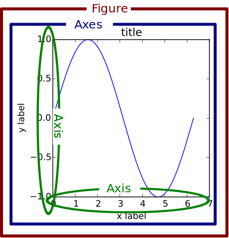

.. _usage-faq:

***************
Usage
***************

.. contents::
   :backlinks: none

.. _general_concepts:

General Concepts
================

:mod:`matplotlib` has an extensive codebase that can be daunting to many
new users. However, most of matplotlib can be understood with a fairly
simple conceptual framework and knowledge of a few important points.

Plotting requires action on a range of levels, from the most general
(e.g., 'contour this 2-D array') to the most specific (e.g., 'color
this screen pixel red'). The purpose of a plotting package is to assist
you in visualizing your data as easily as possible, with all the necessary
control -- that is, by using relatively high-level commands most of
the time, and still have the ability to use the low-level commands when
needed.

Therefore, everything in matplotlib is organized in a hierarchy. At the top
of the hierarchy is the matplotlib "state-machine environment" which is
provided by the :mod:`matplotlib.pyplot` module. At this level, simple
functions are used to add plot elements (lines, images, text, etc.) to
the current axes in the current figure.

.. note::
   Pyplot's state-machine environment behaves similarly to MATLAB and
   should be most familiar to users with MATLAB experience.

The next level down in the hierarchy is the first level of the object-oriented
interface, in which pyplot is used only for a few functions such as figure
creation, and the user explicitly creates and keeps track of the figure
and axes objects. At this level, the user uses pyplot to create figures,
and through those figures, one or more axes objects can be created. These
axes objects are then used for most plotting actions.

For even more control -- which is essential for things like embedding
matplotlib plots in GUI applications -- the pyplot level may be dropped
completely, leaving a purely object-oriented approach.

.. _figure_parts:

Parts of a Figure
=================

:class:`~matplotlib.figure.Figure`
----------------------------------

The **whole** figure (marked as the outer red box).  The figure keeps
track of all the child :class:`~matplotlib.axes.Axes`, a smattering of
'special' artists (titles, figure legends, etc), and the **canvas**.
(Don't worry too much about the canvas, it is crucial as it is the
object that actually does the drawing to get you your plot, but as the
user it is more-or-less invisible to you).  A figure can have any
number of :class:`~matplotlib.axes.Axes`, but to be useful should have
at least one.

The easiest way to create a new figure is with pyplot::

    fig = plt.figure()  # an empty figure with no axes
    fig, ax_lst = plt.subplots(2, 2)  # a figure with a 2x2 grid of Axes

:class:`~matplotlib.axes.Axes`
------------------------------

This is what you think of as 'a plot', it is the region of the image
with the data space (marked as the inner blue box).  A given figure
can contain many Axes, but a given :class:`~matplotlib.axes.Axes`
object can only be in one :class:`~matplotlib.figure.Figure`.  The
Axes contains two (or three in the case of 3D)
:class:`~matplotlib.axis.Axis` objects (be aware of the difference
between **Axes** and **Axis**) which take care of the data limits (the
data limits can also be controlled via set via the
:meth:`~matplotlib.axes.Axes.set_xlim` and
:meth:`~matplotlib.axes.Axes.set_ylim` :class:`Axes` methods).  Each
:class:`Axes` has a title (set via
:meth:`~matplotlib.axes.Axes.set_title`), an x-label (set via
:meth:`~matplotlib.axes.Axes.set_xlabel`), and a y-label set via
:meth:`~matplotlib.axes.Axes.set_ylabel`).

The :class:`Axes` class and it's member functions are the primary entry
point to working with the OO interface.

:class:`~matplotlib.axis.Axis`
------------------------------

These are the number-line-like objects (circled in green).  They take
care of setting the graph limits and generating the ticks (the marks
on the axis) and ticklabels (strings labeling the ticks).  The
location of the ticks is determined by a
:class:`~matplotlib.ticker.Locator` object and the ticklabel strings
are formatted by a :class:`~matplotlib.ticker.Formatter`.  The
combination of the correct :class:`Locator` and :class:`Formatter` gives
very fine control over the tick locations and labels.

:class:`~matplotlib.artist.Artist`
----------------------------------

Basically everything you can see on the figure is an artist (even the
:class:`Figure`, :class:`Axes`, and :class:`Axis` objects).  This
includes :class:`Text` objects, :class:`Line2D` objects,
:class:`collection` objects, :class:`Patch` objects ... (you get the
idea).  When the figure is rendered, all of the artists are drawn to
the **canvas**.  Most Artists are tied to an Axes; such an Artist
cannot be shared by multiple Axes, or moved from one to another.

.. _input_types:

Types of inputs to plotting functions
=====================================

All of plotting functions expect `np.array` or `np.ma.masked_array` as
input.  Classes that are 'array-like' such as `pandas` data objects
and `np.matrix` may or may not work as intended.  It is best to
convert these to `np.array` objects prior to plotting.

For example, to covert a `pandas.DataFrame` ::

  a = pandas.DataFrame(np.random.rand(4,5), columns = list('abcde'))
  a_asndarray = a.values

and to covert a `np.matrix` ::

  b = np.matrix([[1,2],[3,4]])
  b_asarray = np.asarray(b)

.. _pylab:

Matplotlib, pyplot and pylab: how are they related?
====================================================

Matplotlib is the whole package; :mod:`matplotlib.pyplot`
is a module in matplotlib; and :mod:`pylab` is a module
that gets installed alongside :mod:`matplotlib`.

Pyplot provides the state-machine interface to the underlying
object-oriented plotting library.  The state-machine implicitly and
automatically creates figures and axes to achieve the desired
plot. For example::

      import matplotlib.pyplot as plt
      import numpy as np

      x = np.linspace(0, 2, 100)

      plt.plot(x, x, label='linear')
      plt.plot(x, x**2, label='quadratic')
      plt.plot(x, x**3, label='cubic')

      plt.xlabel('x label')
      plt.ylabel('y label')

      plt.title("Simple Plot")

      plt.legend()

      plt.show()

The first call to ``plt.plot`` will automatically create the necessary
figure and axes to achieve the desired plot.  Subsequent calls to
``plt.plot`` re-use the current axes and each add another line.
Setting the title, legend, and axis labels also automatically use the
current axes and set the title, create the legend, and label the axis
respectively.

:mod:`pylab` is a convenience module that bulk imports
:mod:`matplotlib.pyplot` (for plotting) and :mod:`numpy`
(for mathematics and working with arrays) in a single name space.
Although many examples use :mod:`pylab`, it is no longer recommended.

For non-interactive plotting it is suggested
to use pyplot to create the figures and then the OO interface for
plotting.

.. _coding_styles:

Coding Styles
==================

When viewing this documentation and examples, you will find different
coding styles and usage patterns. These styles are perfectly valid
and have their pros and cons. Just about all of the examples can be
converted into another style and achieve the same results.
The only caveat is to avoid mixing the coding styles for your own code.

.. note::
   Developers for matplotlib have to follow a specific style and guidelines.
   See :ref:`developers-guide-index`.

Of the different styles, there are two that are officially supported.
Therefore, these are the preferred ways to use matplotlib.

For the pyplot style, the imports at the top of your
scripts will typically be::

    import matplotlib.pyplot as plt
    import numpy as np

Then one calls, for example, np.arange, np.zeros, np.pi, plt.figure,
plt.plot, plt.show, etc.  Use the pyplot interface
for creating figures, and then use the object methods for the rest::

    import matplotlib.pyplot as plt
    import numpy as np
    x = np.arange(0, 10, 0.2)
    y = np.sin(x)
    fig = plt.figure()
    ax = fig.add_subplot(111)
    ax.plot(x, y)
    plt.show()

So, why all the extra typing instead of the MATLAB-style (which relies
on global state and a flat namespace)?  For very simple things like
this example, the only advantage is academic: the wordier styles are
more explicit, more clear as to where things come from and what is
going on.  For more complicated applications, this explicitness and
clarity becomes increasingly valuable, and the richer and more
complete object-oriented interface will likely make the program easier
to write and maintain.

Typically one finds oneself making the same plots over and over
again, but with different data sets, which leads to needing to write
specialized functions to do the plotting.  The recommended function
signature is something like: ::

    def my_plotter(ax, data1, data2, param_dict):
        """
        A helper function to make a graph

        Parameters
        ----------
        ax : Axes
            The axes to draw to

        data1 : array
           The x data

        data2 : array
           The y data

        param_dict : dict
           Dictionary of kwargs to pass to ax.plot

        Returns
        -------
        out : list
            list of artists added
        """
        out = ax.plot(data1, data2, **param_dict)
        return out

which you would then use as::

    fig, ax = plt.subplots(1, 1)
    my_plotter(ax, data1, data2, {'marker':'x'})

or if you wanted to have 2 sub-plots::

    fig, (ax1, ax2) = plt.subplots(1, 2)
    my_plotter(ax1, data1, data2, {'marker':'x'})
    my_plotter(ax2, data3, data4, {'marker':'o'})

Again, for these simple examples this style seems like overkill, however
once the graphs get slightly more complex it pays off.

.. _what-is-a-backend:

What is a backend?
==================

A lot of documentation on the website and in the mailing lists refers
to the "backend" and many new users are confused by this term.
matplotlib targets many different use cases and output formats.  Some
people use matplotlib interactively from the python shell and have
plotting windows pop up when they type commands.  Some people embed
matplotlib into graphical user interfaces like wxpython or pygtk to
build rich applications.  Others use matplotlib in batch scripts to
generate postscript images from some numerical simulations, and still
others in web application servers to dynamically serve up graphs.

To support all of these use cases, matplotlib can target different
outputs, and each of these capabilities is called a backend; the
"frontend" is the user facing code, i.e., the plotting code, whereas the
"backend" does all the hard work behind-the-scenes to make the figure.
There are two types of backends: user interface backends (for use in
pygtk, wxpython, tkinter, qt4, or macosx; also referred to as
"interactive backends") and hardcopy backends to make image files
(PNG, SVG, PDF, PS; also referred to as "non-interactive backends").

There are a two primary ways to configure your backend.  One is to set
the ``backend`` parameter in your ``matplotlibrc`` file (see
:ref:`customizing-matplotlib`)::

    backend : WXAgg   # use wxpython with antigrain (agg) rendering

The other is to use the matplotlib :func:`~matplotlib.use` directive::

    import matplotlib
    matplotlib.use('PS')   # generate postscript output by default

If you use the ``use`` directive, this must be done before importing
:mod:`matplotlib.pyplot` or :mod:`matplotlib.pylab`.

.. note::
   Backend name specifications are not case-sensitive; e.g., 'GTKAgg'
   and 'gtkagg' are equivalent.

With a typical installation of matplotlib, such as from a
binary installer or a linux distribution package, a good default
backend will already be set, allowing both interactive work and
plotting from scripts, with output to the screen and/or to
a file, so at least initially you will not need to use either of the
two methods given above.

If, however, you want to write graphical user interfaces, or a web
application server (:ref:`howto-webapp`), or need a better
understanding of what is going on, read on. To make things a little
more customizable for graphical user interfaces, matplotlib separates
the concept of the renderer (the thing that actually does the drawing)
from the canvas (the place where the drawing goes).  The canonical
renderer for user interfaces is ``Agg`` which uses the `Anti-Grain
Geometry`_ C++ library to make a raster (pixel) image of the figure.
All of the user interfaces except ``macosx`` can be used with
agg rendering, e.g.,
``WXAgg``, ``GTKAgg``, ``QT4Agg``, ``TkAgg``.  In
addition, some of the user interfaces support other rendering engines.
For example, with GTK, you can also select GDK rendering (backend
``GTK``) or Cairo rendering (backend ``GTKCairo``).

For the rendering engines, one can also distinguish between `vector
<http://en.wikipedia.org/wiki/Vector_graphics>`_ or `raster
<http://en.wikipedia.org/wiki/Raster_graphics>`_ renderers.  Vector
graphics languages issue drawing commands like "draw a line from this
point to this point" and hence are scale free, and raster backends
generate a pixel representation of the line whose accuracy depends on a
DPI setting.

Here is a summary of the matplotlib renderers (there is an eponymous
backed for each; these are *non-interactive backends*, capable of
writing to a file):

=============   ============   ================================================
Renderer        Filetypes      Description
=============   ============   ================================================
:term:`AGG`     :term:`png`    :term:`raster graphics` -- high quality images
                               using the `Anti-Grain Geometry`_ engine
PS              :term:`ps`     :term:`vector graphics` -- Postscript_ output
                :term:`eps`
PDF             :term:`pdf`    :term:`vector graphics` --
                               `Portable Document Format`_
SVG             :term:`svg`    :term:`vector graphics` --
                               `Scalable Vector Graphics`_
:term:`Cairo`   :term:`png`    :term:`vector graphics` --
                :term:`ps`     `Cairo graphics`_
                :term:`pdf`
                :term:`svg`
                ...
:term:`GDK`     :term:`png`    :term:`raster graphics` --
                :term:`jpg`    the `Gimp Drawing Kit`_
                :term:`tiff`
                ...
=============   ============   ================================================

And here are the user interfaces and renderer combinations supported;
these are *interactive backends*, capable of displaying to the screen
and of using appropriate renderers from the table above to write to
a file:

============   ================================================================
Backend        Description
============   ================================================================
GTKAgg         Agg rendering to a :term:`GTK` 2.x canvas (requires PyGTK_)
GTK3Agg        Agg rendering to a :term:`GTK` 3.x canvas (requires PyGObject_)
GTK            GDK rendering to a :term:`GTK` 2.x canvas (not recommended)
               (requires PyGTK_)
GTKCairo       Cairo rendering to a :term:`GTK` 2.x canvas (requires PyGTK_
               and pycairo_)
GTK3Cairo      Cairo rendering to a :term:`GTK` 3.x canvas (requires PyGObject_
               and pycairo_)
WXAgg          Agg rendering to to a :term:`wxWidgets` canvas
               (requires wxPython_)
WX             Native :term:`wxWidgets` drawing to a :term:`wxWidgets` Canvas
               (not recommended) (requires wxPython_)
TkAgg          Agg rendering to a :term:`Tk` canvas (requires TkInter_)
Qt4Agg         Agg rendering to a :term:`Qt4` canvas (requires PyQt4_)
macosx         Cocoa rendering in OSX windows
               (presently lacks blocking show() behavior when matplotlib
               is in non-interactive mode)
============   ================================================================

.. _`Anti-Grain Geometry`: http://agg.sourceforge.net/antigrain.com/index.html
.. _Postscript: http://en.wikipedia.org/wiki/PostScript
.. _`Portable Document Format`: http://en.wikipedia.org/wiki/Portable_Document_Format
.. _`Scalable Vector Graphics`: http://en.wikipedia.org/wiki/Scalable_Vector_Graphics
.. _`Cairo graphics`: http://en.wikipedia.org/wiki/Cairo_(graphics)
.. _`Gimp Drawing Kit`: http://en.wikipedia.org/wiki/GDK
.. _PyGTK: http://www.pygtk.org
.. _PyGObject: https://live.gnome.org/PyGObject
.. _pycairo: http://www.cairographics.org/pycairo/
.. _wxPython: http://www.wxpython.org/
.. _TkInter: http://wiki.python.org/moin/TkInter
.. _PyQt4: http://www.riverbankcomputing.co.uk/software/pyqt/intro

How do I select PyQt4 or PySide?
========================================

You can choose either PyQt4 or PySide when using the `qt4` backend by setting
the appropriate value for `backend.qt4` in your :file:`matplotlibrc` file. The
default value is `PyQt4`.

The setting in your :file:`matplotlibrc` file can be overridden by setting the
`QT_API` environment variable to either `pyqt` or `pyside` to use `PyQt4` or
`PySide`, respectively.

Since the default value for the bindings to be used is `PyQt4`,
:mod:`matplotlib` first tries to import it, if the import fails, it tries to
import `PySide`.

.. _interactive-mode:

What is interactive mode?
===================================

Use of an interactive backend (see :ref:`what-is-a-backend`)
permits--but does not by itself require or ensure--plotting
to the screen.  Whether and when plotting to the screen occurs,
and whether a script or shell session continues after a plot
is drawn on the screen, depends on the functions and methods
that are called, and on a state variable that determines whether
matplotlib is in "interactive mode".  The default Boolean value is set
by the :file:`matplotlibrc` file, and may be customized like any other
configuration parameter (see :ref:`customizing-matplotlib`).  It
may also be set via :func:`matplotlib.interactive`, and its
value may be queried via :func:`matplotlib.is_interactive`.  Turning
interactive mode on and off in the middle of a stream of plotting
commands, whether in a script or in a shell, is rarely needed
and potentially confusing, so in the following we will assume all
plotting is done with interactive mode either on or off.

.. note::
   Major changes related to interactivity, and in particular the
   role and behavior of :func:`~matplotlib.pyplot.show`, were made in the
   transition to matplotlib version 1.0, and bugs were fixed in
   1.0.1.  Here we describe the version 1.0.1 behavior for the
   primary interactive backends, with the partial exception of
   *macosx*.

Interactive mode may also be turned on via :func:`matplotlib.pyplot.ion`,
and turned off via :func:`matplotlib.pyplot.ioff`.

.. note::
   Interactive mode works with suitable backends in ipython and in
   the ordinary python shell, but it does *not* work in the IDLE IDE.

Interactive example
--------------------

From an ordinary python prompt, or after invoking ipython with no options,
try this::

    import matplotlib.pyplot as plt
    plt.ion()
    plt.plot([1.6, 2.7])

Assuming you are running version 1.0.1 or higher, and you have
an interactive backend installed and selected by default, you should
see a plot, and your terminal prompt should also be active; you
can type additional commands such as::

    plt.title("interactive test")
    plt.xlabel("index")

and you will see the plot being updated after each line.  This is
because you are in interactive mode *and* you are using pyplot
functions.  Now try an alternative method of modifying the
plot.  Get a
reference to the :class:`~matplotlib.axes.Axes` instance, and
call a method of that instance::

    ax = plt.gca()
    ax.plot([3.1, 2.2])

Nothing changed, because the Axes methods do not include an
automatic call to :func:`~matplotlib.pyplot.draw_if_interactive`;
that call is added by the pyplot functions.  If you are using
methods, then when you want to update the plot on the screen,
you need to call :func:`~matplotlib.pyplot.draw`::

    plt.draw()

Now you should see the new line added to the plot.

Non-interactive example
-----------------------

Start a fresh session as in the previous example, but now
turn interactive mode off::

    import matplotlib.pyplot as plt
    plt.ioff()
    plt.plot([1.6, 2.7])

Nothing happened--or at least nothing has shown up on the
screen (unless you are using *macosx* backend, which is
anomalous).  To make the plot appear, you need to do this::

    plt.show()

Now you see the plot, but your terminal command line is
unresponsive; the :func:`show()` command *blocks* the input
of additional commands until you manually kill the plot
window.

What good is this--being forced to use a blocking function?
Suppose you need a script that plots the contents of a file
to the screen.  You want to look at that plot, and then end
the script.  Without some blocking command such as show(), the
script would flash up the plot and then end immediately,
leaving nothing on the screen.

In addition, non-interactive mode delays all drawing until
show() is called; this is more efficient than redrawing
the plot each time a line in the script adds a new feature.

Prior to version 1.0, show() generally could not be called
more than once in a single script (although sometimes one
could get away with it); for version 1.0.1 and above, this
restriction is lifted, so one can write a script like this::

    import numpy as np
    import matplotlib.pyplot as plt
    plt.ioff()
    for i in range(3):
        plt.plot(np.random.rand(10))
        plt.show()

which makes three plots, one at a time.

Summary
-------

In interactive mode, pyplot functions automatically draw
to the screen.

When plotting interactively, if using
object method calls in addition to pyplot functions, then
call :func:`~matplotlib.pyplot.draw` whenever you want to
refresh the plot.

Use non-interactive mode in scripts in which you want to
generate one or more figures and display them before ending
or generating a new set of figures.  In that case, use
:func:`~matplotlib.pyplot.show` to display the figure(s) and
to block execution until you have manually destroyed them.
