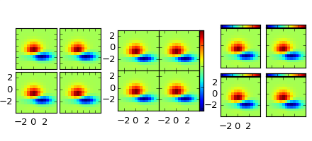

.. _toolkit_axesgrid-index:

Matplotlib AxesGrid Toolkit
===========================

The matplotlib AxesGrid toolkit is a collection of helper classes to
ease displaying multiple images in matplotlib.  While the aspect
parameter in matplotlib adjust the position of the single axes,
AxesGrid toolkit provides a framework to adjust the position of
multiple axes according to their aspects.

.. note::
   AxesGrid toolkit has been a part of matplotlib since v
   0.99. Originally, the toolkit had a single namespace of
   *axes_grid*. In more recent version (since svn r8226), the toolkit
   has divided into two separate namespace (*axes_grid1* and *axisartist*).
   While *axes_grid* namespace is maintained for the backward compatibility,
   use of *axes_grid1* and *axisartist* is recommended.

.. warning::
   *axes_grid* and *axisartist* (but not *axes_grid1*) uses
   a custom Axes class (derived from the mpl's original Axes class).
   As a side effect, some commands (mostly tick-related) do not work.
   Use *axes_grid1* to avoid this, or see how things are different in
   *axes_grid* and *axisartist* (LINK needed)

.. toctree::
   :maxdepth: 2

   users/overview.rst
   users/index.rst
   api/index.rst
