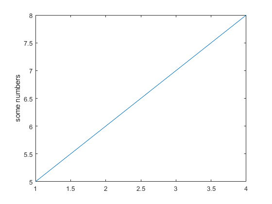
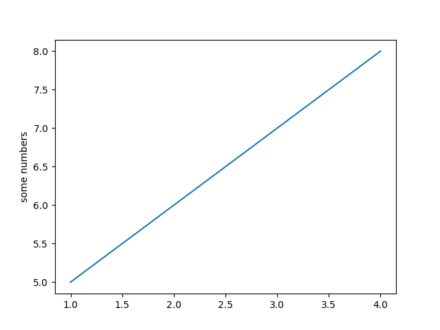

.. _matplotlib-for-matlab-users:

================================
WIP: Matplotlib for Matlab users
================================

Introduction
============

This page is intended to be a reference for new matplotlib users who are coming
from MATLAB®.

.. raw:: html

   

First Things First
====================

.. list-table::
   :header-rows: 1

   * - MATLAB
     - Matplotlib

   * - ::

        x = [1, 2, 3, 4];
        y = [5, 6, 7, 8];

        plot(x, y);
        ylabel("some numbers");

     - ::

        import matplotlib.pyplot as plt

        x = [1, 2, 3, 4]
        y = [5, 6, 7, 8]

        plt.plot(x, y)
        plt.ylabel('some numbers')
        plt.show()

   * - |image_matlab|
     - |image_matploblib|

Table of Rough MATLAB-Matplotlib Equivalents
============================================
.. list-table::
   :header-rows: 1

   * - MATLAB
     - Matplotlib
     - Notes

   * - ``ylim([-2 2])``
     - ``plt.set_ylim(-2, 2)``
     - Set y-limit

   * - ``figure('position', [0, 0, 500, 200])``
     - ``plt.figure(figsize=(6,3))``
     - Create a figure with specific size. MATLAB: left bottom width height;
       Matplotlib: width height

   * - ``ylabel("some text")``
     - ``plt.ylabel("some text")``
     - Set y-label

Some Key Differences
====================
.. list-table::
   :header-rows: 1

   * - MATLAB
     - Matplotlib
   * - placeholder
     - placeholder

Credits
================
This guide is inpired by its counterpart in `Scipy/Numpy\
<https://docs.scipy.org/doc/numpy/user/numpy-for-matlab-users.html>`_, which
is another an excellent read for users coming from MATLAB®.

MATLAB® is registered trademarks of The MathWorks.
