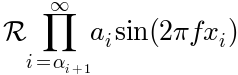
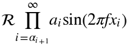
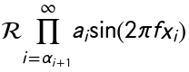

.. _mathtext-tutorial:

Writing mathematical expressions
================================

You can use a subset TeX markup in any matplotlib text string by
placing it inside a pair of dollar signs ($).

Note that you do not need to have TeX installed, since matplotlib
ships its own TeX expression parser, layout engine and fonts.  The
layout engine is a fairly direct adaptation of the layout algorithms
in Donald Knuth's TeX, so the quality is quite good (matplotlib also
provides a ``usetex`` option for those who do want to call out to TeX
to generate their text (see :ref:`usetex-tutorial`).

Any text element can use math text.  You should use raw strings
(precede the quotes with an ``'r'``), and surround the math text with
dollar signs ($), as in TeX.  Regular text and mathtext can be
interleaved within the same string.  Mathtext can use the Computer
Modern fonts (from (La)TeX), `STIX <http://www.aip.org/stixfonts/>`_
fonts (with are designed to blend well with Times) or a Unicode font
that you provide.  The mathtext font can be selected with the
customization variable ``mathtext.fontset`` (see
:ref:`customizing-matplotlib`)

.. note::
   On `"narrow" <http://wordaligned.org/articles/narrow-python>`_ builds
   of Python, if you use the STIX fonts you should also set
   ``ps.fonttype`` and ``pdf.fonttype`` to 3 (the default), not 42.
   Otherwise `some characters will not be visible
   <http://thread.gmane.org/gmane.comp.python.matplotlib.general/19963/focus=19978>`_.

Here is a simple example::

    # plain text
    plt.title('alpha > beta')

produces "alpha > beta".

Whereas this::

    # math text
    plt.title(r'$\alpha > \beta$')

produces ":math:`\alpha > \beta`".

.. note::
   Mathtext should be placed between a pair of dollar signs ($).  To
   make it easy to display monetary values, e.g., "$100.00", if a
   single dollar sign is present in the entire string, it will be
   displayed verbatim as a dollar sign.  This is a small change from
   regular TeX, where the dollar sign in non-math text would have to
   be escaped ('\$').

.. note::
   While the syntax inside the pair of dollar signs ($) aims to be
   TeX-like, the text outside does not.  In particular, characters
   such as::

     # $ % & ~ _ ^ \ { } \( \) \[ \]

   have special meaning outside of math mode in TeX.  Therefore, these
   characters will behave differently depending on the rcParam
   ``text.usetex`` flag.  See the :ref:`usetex tutorial
   <usetex-tutorial>` for more information.

Subscripts and superscripts
---------------------------

To make subscripts and superscripts, use the ``'_'`` and ``'^'`` symbols::

    r'$\alpha_i > \beta_i$'

.. math::

    \alpha_i > \beta_i

Some symbols automatically put their sub/superscripts under and over
the operator.  For example, to write the sum of :math:`x_i` from :math:`0` to
:math:`\infty`, you could do::

    r'$\sum_{i=0}^\infty x_i$'

.. math::

    \sum_{i=0}^\infty x_i

Fractions, binomials and stacked numbers
----------------------------------------

Fractions, binomials and stacked numbers can be created with the
``\frac{}{}``, ``\binom{}{}`` and ``\stackrel{}{}`` commands,
respectively::

    r'$\frac{3}{4} \binom{3}{4} \stackrel{3}{4}$'

produces

.. math::

    \frac{3}{4} \binom{3}{4} \stackrel{3}{4}

Fractions can be arbitrarily nested::

    r'$\frac{5 - \frac{1}{x}}{4}$'

produces

.. math::

    \frac{5 - \frac{1}{x}}{4}

Note that special care needs to be taken to place parentheses and brackets around
fractions.  Doing things the obvious way produces brackets that are
too small::

    r'$(\frac{5 - \frac{1}{x}}{4})$'

.. math ::

    (\frac{5 - \frac{1}{x}}{4})

The solution is to precede the bracket with ``\left`` and ``\right``
to inform the parser that those brackets encompass the entire object::

    r'$\left(\frac{5 - \frac{1}{x}}{4}\right)$'

.. math ::

    \left(\frac{5 - \frac{1}{x}}{4}\right)

Radicals
--------

Radicals can be produced with the ``\sqrt[]{}`` command.  For example::

    r'$\sqrt{2}$'

.. math ::

    \sqrt{2}

Any base can (optionally) be provided inside square brackets.  Note
that the base must be a simple expression, and can not contain layout
commands such as fractions or sub/superscripts::

    r'$\sqrt[3]{x}$'

.. math ::

    \sqrt[3]{x}

Fonts
-----

The default font is *italics* for mathematical symbols.

.. note::

   This default can be changed using the ``mathtext.default`` rcParam.
   This is useful, for example, to use the same font as regular
   non-math text for math text, by setting it to ``regular``.

To change fonts, e.g., to write "sin" in a Roman font, enclose the text
in a font command::

    r'$s(t) = \mathcal{A}\mathrm{sin}(2 \omega t)$'

.. math::

    s(t) = \mathcal{A}\mathrm{sin}(2 \omega t)

More conveniently, many commonly used function names that are typeset in a
Roman font have shortcuts.  So the expression above could be written
as follows::

    r'$s(t) = \mathcal{A}\sin(2 \omega t)$'

.. math::

    s(t) = \mathcal{A}\sin(2 \omega t)

Here "s" and "t" are variable in italics font (default), "sin" is in
Roman font, and the amplitude "A" is in calligraphy font.  Note in the
example above the caligraphy ``A`` is squished into the ``sin``.  You
can use a spacing command to add a little whitespace between them::

    s(t) = \mathcal{A}\/\sin(2 \omega t)

.. math::

    s(t) = \mathcal{A}\/\sin(2 \omega t)

The choices available with all fonts are:

    ============================ ==================================
    Command                      Result
    ============================ ==================================
    ``\mathrm{Roman}``           :math:`\mathrm{Roman}`
    ``\mathit{Italic}``          :math:`\mathit{Italic}`
    ``\mathtt{Typewriter}``      :math:`\mathtt{Typewriter}`
    ``\mathcal{CALLIGRAPHY}``    :math:`\mathcal{CALLIGRAPHY}`
    ============================ ==================================

.. role:: math-stix(math)
   :fontset: stix

When using the `STIX <http://www.aip.org/stixfonts/>`_ fonts, you also have the choice of:

    ====================================== =========================================
    Command                                Result
    ====================================== =========================================
    ``\mathbb{blackboard}``                :math-stix:`\mathbb{blackboard}`
    ``\mathrm{\mathbb{blackboard}}``       :math-stix:`\mathrm{\mathbb{blackboard}}`
    ``\mathfrak{Fraktur}``                 :math-stix:`\mathfrak{Fraktur}`
    ``\mathsf{sansserif}``                 :math-stix:`\mathsf{sansserif}`
    ``\mathrm{\mathsf{sansserif}}``        :math-stix:`\mathrm{\mathsf{sansserif}}`
    ====================================== =========================================

.. htmlonly::

    ====================================== =========================================
    ``\mathcircled{circled}``              :math-stix:`\mathcircled{circled}`
    ====================================== =========================================

There are also three global "font sets" to choose from, which are
selected using the ``mathtext.fontset`` parameter in
:ref:`matplotlibrc <matplotlibrc-sample>`.

``cm``: **Computer Modern (TeX)**

``stix``: **STIX** (designed to blend well with Times)

``stixsans``: **STIX sans-serif**

Additionally, you can use ``\mathdefault{...}`` or its alias
``\mathregular{...}`` to use the font used for regular text outside of
mathtext.  There are a number of limitations to this approach, most
notably that far fewer symbols will be available, but it can be useful
to make math expressions blend well with other text in the plot.

Custom fonts
~~~~~~~~~~~~

mathtext also provides a way to use custom fonts for math.  This
method is fairly tricky to use, and should be considered an
experimental feature for patient users only.  By setting the rcParam
``mathtext.fontset`` to ``custom``, you can then set the following
parameters, which control which font file to use for a particular set
of math characters.

    ============================== =================================
    Parameter                      Corresponds to
    ============================== =================================
    ``mathtext.it``                ``\mathit{}`` or default italic
    ``mathtext.rm``                ``\mathrm{}`` Roman (upright)
    ``mathtext.tt``                ``\mathtt{}`` Typewriter (monospace)
    ``mathtext.bf``                ``\mathbf{}`` bold italic
    ``mathtext.cal``               ``\mathcal{}`` calligraphic
    ``mathtext.sf``                ``\mathsf{}`` sans-serif
    ============================== =================================

Each parameter should be set to a fontconfig font descriptor (as
defined in the yet-to-be-written font chapter).

.. TODO: Link to font chapter

The fonts used should have a Unicode mapping in order to find any
non-Latin characters, such as Greek.  If you want to use a math symbol
that is not contained in your custom fonts, you can set the rcParam
``mathtext.fallback_to_cm`` to ``True`` which will cause the mathtext
system to use characters from the default Computer Modern fonts
whenever a particular character can not be found in the custom font.

Note that the math glyphs specified in Unicode have evolved over time,
and many fonts may not have glyphs in the correct place for mathtext.

Accents
-------

An accent command may precede any symbol to add an accent above it.
There are long and short forms for some of them.

    ============================== =================================
    Command                        Result
    ============================== =================================
    ``\acute a`` or ``\'a``        :math:`\acute a`
    ``\bar a``                     :math:`\bar a`
    ``\breve a``                   :math:`\breve a`
    ``\ddot a`` or ``\"a``         :math:`\ddot a`
    ``\dot a`` or ``\.a``          :math:`\dot a`
    ``\grave a`` or ``\`a``        :math:`\grave a`
    ``\hat a`` or ``\^a``          :math:`\hat a`
    ``\tilde a`` or ``\~a``        :math:`\tilde a`
    ``\vec a``                     :math:`\vec a`
    ``\overline{abc}``             :math:`\overline{abc}`
    ============================== =================================

In addition, there are two special accents that automatically adjust
to the width of the symbols below:

    ============================== =================================
    Command                        Result
    ============================== =================================
    ``\widehat{xyz}``              :math:`\widehat{xyz}`
    ``\widetilde{xyz}``            :math:`\widetilde{xyz}`
    ============================== =================================

Care should be taken when putting accents on lower-case i's and j's.
Note that in the following ``\imath`` is used to avoid the extra dot
over the i::

    r"$\hat i\ \ \hat \imath$"

.. math::

    \hat i\ \ \hat \imath

Symbols
-------

You can also use a large number of the TeX symbols, as in ``\infty``,
``\leftarrow``, ``\sum``, ``\int``.

.. math_symbol_table::

If a particular symbol does not have a name (as is true of many of the
more obscure symbols in the STIX fonts), Unicode characters can
also be used::

   ur'$\u23ce$'

Example
-------

Here is an example illustrating many of these features in context.

.. plot:: pyplots/pyplot_mathtext.py
   :include-source:

