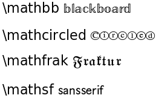

.. _mathtext-tutorial:

Writing mathematical expressions
================================

You can use TeX markup in any matplotlib text string; see the
:mod:`matplotlib.mathtext` module documentation for details.  Note
that you do not need to have TeX installed, since matplotlib ships its
own TeX expression parser, layout engine and fonts.  The layout engine
is a fairly direct adaptation of the layout algorithms in Donald
Knuth's TeX, so the quality is quite good (matplotlib also provides a
``usetex`` option for those who do want to call out to TeX to generate
their text).

Any text element can use math text.  You need to use raw strings
(preceed the quotes with an ``'r'``), and surround the string text
with dollar signs, as in TeX.  Regular text and mathtext can be
interleaved within the same string.  Mathtext can use the Computer
Modern fonts (from (La)TeX), `STIX <http://www.aip.org/stixfonts/>`_
fonts (with are designed to blend well with Times) or a Unicode font
that you provide.  The mathtext font can be selected with the
customization variable ``mathtext.fontset``.

Here is a simple example::

    # plain text
    plt.title('alpha > beta')

produces "alpha > beta".

Whereas this::

    # math text
    plt.title(r'$\alpha > \beta$')

produces ":math:`\alpha > \beta`".

.. TODO: Include a complete list here

Subscripts and superscripts
---------------------------

To make subscripts and superscripts, use the ``'_'`` and ``'^'`` symbols::

    r'$\alpha_i > \beta_i$'

.. math::

    \alpha_i > \beta_i

Some symbols automatically put their sub/superscripts under and over
the operator.  For example, to write the sum of :math:`x_i` from :math:`0` to
:math:`\infty`, you could do::

    r'$\sum_{i=0}^\infty x_i$'

.. math::

    \sum_{i=0}^\infty x_i

Fractions
---------

Fractions can be created with the ``\frac{}{}`` command::

    r'$\frac{3}{4}$'

produces

.. math::

    \frac{3}{4}

Fractions can be arbitrarily nested::

    r'$\frac{5 - \frac{1}{x}}{4}$'

produces

.. math::

    \frac{5 - \frac{1}{x}}{4}

Note that special care needs to be taken to place parentheses and brackets around
fractions.  Doing things the obvious way produces brackets that are
too small::

    r'$(\frac{5 - \frac{1}{x}}{4})$'

.. math ::

    (\frac{5 - \frac{1}{x}}{4})

The solution is to precede the bracket with ``\left`` and ``\right``
to inform the parser that those brackets encompass the entire object::

    r'$\left(\frac{5 - \frac{1}{x}}{4}\right)$'

.. math ::

    \left(\frac{5 - \frac{1}{x}}{4}\right)

Radicals
--------

Radicals can be produced with the ``\sqrt[]{}`` command.  For example:

    r'$\sqrt{2}$'

.. math ::

    \sqrt{2}

Any base can (optionally) be provided inside square brackets.  Note
that the base must be a simple expression, and can not contain layout
commands such as fractions or sub/superscripts.

    r'$\sqrt[3]{x}$'

.. math ::

    \sqrt[3]{x}

Fonts
-----

The default font is *italics* for mathematical symbols.  To change
fonts, eg, to write "sin" in a Roman font, enclose the text in a font
command::

    r'$s(t) = \mathcal{A}\mathrm{sin}(2 \omega t)$'

.. math::

    s(t) = \mathcal{A}\mathrm{sin}(2 \omega t)

More conveniently, many commonly used function names that are typeset in a
Roman font have shortcuts.  So the expression above could be written
as follows::

    r'$s(t) = \mathcal{A}\sin(2 \omega t)$'

.. math::

    s(t) = \mathcal{A}\sin(2 \omega t)

Here "s" and "t" are variable in italics font (default), "sin" is in
Roman font, and the amplitude "A" is in calligraphy font.

The choices available with all fonts are:

    =============== =================================
    Command         Result
    =============== =================================
    ``\mathrm``     :math:`\mathrm{Roman}`
    ``\mathit``     :math:`\mathit{Italic}`
    ``\mathtt``     :math:`\mathtt{Typewriter}`
    ``\mathcal``    :math:`\mathcal{CALLIGRAPHY}`
    =============== =================================

When using the STIX fonts, you also have the choice of:

There are also three global "font sets" to choose from, which are
selected using the ``mathtext.fontset`` parameter in ``matplotibrc``.

``cm``: **Computer Modern (TeX)**

.. image:: ../_static/cm_fontset.png

``stix``: **STIX** (designed to blend well with Times)

.. image:: ../_static/stix_fontset.png

``stixsans``: **STIX sans-serif**

.. image:: ../_static/stixsans_fontset.png

Accents
-------

An accent command may precede any symbol to add an accent above it.
There are long and short forms for some of them.

    ============================== =================================
    Command                        Result
    ============================== =================================
    ``\acute a`` or ``\'a``        :math:`\acute a`
    ``\bar a``                     :math:`\bar a`
    ``\breve a``                   :math:`\breve a`
    ``\ddot a`` or ``\"a``         :math:`\ddot a`
    ``\dot a`` or ``\.a``          :math:`\dot a`
    ``\grave a`` or ``\`a``        :math:`\grave a`
    ``\hat a`` or ``\^a``          :math:`\hat a`
    ``\tilde a`` or ``\~a``        :math:`\tilde a`
    ``\vec a``                     :math:`\vec a`
    ============================== =================================

In addition, there are two special accents that automatically adjust
to the width of the symbols below:

    ============================== =================================
    Command                        Result
    ============================== =================================
    ``\widehat{xyz}``              :math:`\widehat{xyz}`
    ``\widetilde{xyz}``            :math:`\widetilde{xyz}`
    ============================== =================================

Symbols
-------

You can also use a large number of the TeX symbols, as in ``\infty``,
``\leftarrow``, ``\sum``, ``\int``; see :mod:`matplotlib.mathtext` for a
complete list.

If a particular symbol does not have a name (as is true of many of the
more obscure symbols in the STIX fonts), Unicode characters can
also be used::

   ur'Generic symbol: $\u23ce$'

Example
-------

Here is an example illustrating many of these features in context.

.. literalinclude:: figures/pyplot_mathtext.py

.. image:: figures/pyplot_mathtext.png
   :scale: 50

