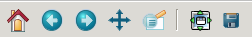

.. _navigation-toolbar:

Interactive navigation
======================

All figure windows come with a navigation toolbar, which can be used
to navigate through the data set.  Here is a description of each of
the buttons at the bottom of the toolbar

.. image:: ../../lib/matplotlib/mpl-data/images/home_large.png

.. image:: ../../lib/matplotlib/mpl-data/images/back_large.png

.. image:: ../../lib/matplotlib/mpl-data/images/forward_large.png

The ``Home``, ``Forward`` and ``Back`` buttons
    These are akin to a web browser's home, forward and back controls.
    ``Forward`` and ``Back`` are used to navigate back and forth between
    previously defined views.  They have no meaning unless you have already
    navigated somewhere else using the pan and zoom buttons.  This is analogous
    to trying to click ``Back`` on your web browser before visiting a
    new page or ``Forward`` before you have gone back to a page --
    nothing happens.  ``Home`` always takes you to the
    first, default view of your data. Again, all of these buttons should
    feel very familiar to any user of a web browser.

.. image:: ../../lib/matplotlib/mpl-data/images/move_large.png

The ``Pan/Zoom`` button
    This button has two modes: pan and zoom.  Click the toolbar button
    to activate panning and zooming, then put your mouse somewhere
    over an axes.  Press the left mouse button and hold it to pan the
    figure, dragging it to a new position.  When you release it, the
    data under the point where you pressed will be moved to the point
    where you released.  If you press 'x' or 'y' while panning the
    motion will be constrained to the x or y axis, respectively.  Press
    the right mouse button to zoom, dragging it to a new position.
    The x axis will be zoomed in proportionately to the rightward
    movement and zoomed out proportionately to the leftward movement.
    The same is true for the y axis and up/down motions.  The point under your
    mouse when you begin the zoom remains stationary, allowing you to
    zoom in or out around that point as much as you wish.  You can use the
    modifier keys 'x', 'y' or 'CONTROL' to constrain the zoom to the x
    axis, the y axis, or aspect ratio preserve, respectively.

    With polar plots, the pan and zoom functionality behaves
    differently.  The radius axis labels can be dragged using the left
    mouse button.  The radius scale can be zoomed in and out using the
    right mouse button.

.. image:: ../../lib/matplotlib/mpl-data/images/zoom_to_rect_large.png

The ``Zoom-to-rectangle`` button
    Click this toolbar button to activate this mode.  Put your mouse somewhere
    over an axes and press a mouse button.  Define a rectangular region by
    dragging the mouse while holding the button to a new location.  When using
    the left mouse button, the axes view limits will be zoomed to the defined
    region.  When using the right mouse button, the axes view limits will be
    zoomed out, placing the original axes in the defined region.

.. image:: ../../lib/matplotlib/mpl-data/images/subplots_large.png

The ``Subplot-configuration`` button
    Use this tool to configure the appearance of the subplot:
    you can stretch or compress the left, right, top, or bottom
    side of the subplot, or the space between the rows or
    space between the columns.

.. image:: ../../lib/matplotlib/mpl-data/images/filesave_large.png

The ``Save`` button
    Click this button to launch a file save dialog.  You can save
    files with the following extensions: ``png``, ``ps``, ``eps``,
    ``svg`` and ``pdf``.

.. _key-event-handling:

Navigation Keyboard Shortcuts
-----------------------------

The following table holds all the default keys, which can be overwritten by use of your matplotlibrc (#keymap.\*).

================================== =================================================
Command                            Keyboard Shortcut(s)
================================== =================================================
Home/Reset                         **h** or **r** or **home**
Back                               **c** or **left arrow** or **backspace**
Forward                            **v** or **right arrow**
Pan/Zoom                           **p**
Zoom-to-rect                       **o**
Save                               **ctrl** + **s**
Toggle fullscreen                  **f** or **ctrl** + **f**
Close plot                         **ctrl** + **w**
Close all plots                    **shift** + **w**
Constrain pan/zoom to x axis       hold **x** when panning/zooming with mouse
Constrain pan/zoom to y axis       hold **y** when panning/zooming with mouse
Preserve aspect ratio              hold **CONTROL** when panning/zooming with mouse
Toggle major grids                 **g** when mouse is over an axes
Toggle minor grids                 **G** when mouse is over an axes
Toggle x axis scale (log/linear)   **L** or **k**  when mouse is over an axes
Toggle y axis scale (log/linear)   **l** when mouse is over an axes
================================== =================================================

If you are using :mod:`matplotlib.pyplot` the toolbar will be created
automatically for every figure.  If you are writing your own user
interface code, you can add the toolbar as a widget.  The exact syntax
depends on your UI, but we have examples for every supported UI in the
``matplotlib/examples/user_interfaces`` directory.  Here is some
example code for GTK+ 3::

    import gi
    gi.require_version('Gtk', '3.0')
    from gi.repository import Gtk

    from matplotlib.figure import Figure
    from matplotlib.backends.backend_gtk3agg import FigureCanvas
    from matplotlib.backends.backend_gtk3 import (
        NavigationToolbar2GTK3 as NavigationToolbar)

    win = Gtk.Window()
    win.connect("destroy", lambda x: Gtk.main_quit())
    win.set_default_size(400,300)
    win.set_title("Embedding in GTK")

    vbox = Gtk.VBox()
    win.add(vbox)

    fig = Figure(figsize=(5,4), dpi=100)
    ax = fig.add_subplot(111)
    ax.plot([1,2,3])

    canvas = FigureCanvas(fig)  # a Gtk.DrawingArea
    vbox.pack_start(canvas, True, True, 0)
    toolbar = NavigationToolbar(canvas, win)
    vbox.pack_start(toolbar, False, False, 0)

    win.show_all()
    Gtk.main()
