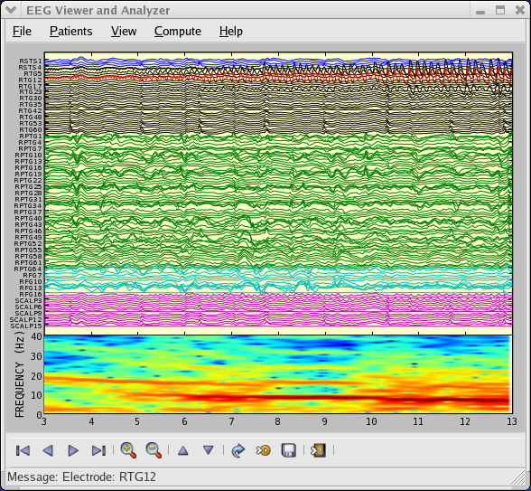

.. _matplotlibscreenshots:

**********************
Screenshots
**********************

Here you'll find a host of example plots with the code that
generated them.

Simple Plot
===========

Here's a very basic :func:`~matplotlib.pyplot.plot` with text labels:

.. plot:: mpl_examples/pylab_examples/simple_plot.py

.. _screenshots_subplot_demo:

Subplot demo
============

Multiple axes (i.e. subplots) are created with the
:func:`~matplotlib.pyplot.subplot` command:

.. plot:: mpl_examples/subplots_axes_and_figures/subplot_demo.py

.. _screenshots_histogram_demo:

Histograms
==========

The :func:`~matplotlib.pyplot.hist` command automatically generates
histograms and returns the bin counts or probabilities:

.. plot:: mpl_examples/statistics/histogram_demo_features.py

.. _screenshots_path_demo:

Path demo
=========

You can add arbitrary paths in matplotlib using the
:mod:`matplotlib.path` module:

.. plot:: mpl_examples/shapes_and_collections/path_patch_demo.py

.. _screenshots_mplot3d_surface:

mplot3d
=========

The mplot3d toolkit (see :ref:`toolkit_mplot3d-tutorial` and
:ref:`mplot3d-examples-index`) has support for simple 3d graphs
including surface, wireframe, scatter, and bar charts.

.. plot:: mpl_examples/mplot3d/surface3d_demo.py

Thanks to John Porter, Jonathon Taylor, Reinier Heeres, and Ben Root for
the `mplot3d` toolkit. This toolkit is included with all standard matplotlib
installs.

.. _screenshots_ellipse_demo:

Streamplot
==========

The :meth:`~matplotlib.pyplot.streamplot` function plots the streamlines of
a vector field. In addition to simply plotting the streamlines, it allows you
to map the colors and/or line widths of streamlines to a separate parameter,
such as the speed or local intensity of the vector field.

.. plot:: mpl_examples/images_contours_and_fields/streamplot_demo_features.py

This feature complements the :meth:`~matplotlib.pyplot.quiver` function for
plotting vector fields. Thanks to Tom Flannaghan and Tony Yu for adding the
streamplot function.

Ellipses
========

In support of the
`Phoenix <http://www.jpl.nasa.gov/news/phoenix/main.php>`_ mission to
Mars (which used matplotlib to display ground tracking of spacecraft),
Michael Droettboom built on work by Charlie Moad to provide an extremely
accurate  8-spline approximation to elliptical arcs (see
:class:`~matplotlib.patches.Arc`), which are insensitive to zoom level.

.. plot:: mpl_examples/pylab_examples/ellipse_demo.py

.. _screenshots_barchart_demo:

Bar charts
==========

Bar charts are simple to create using the :func:`~matplotlib.pyplot.bar`
command, which includes customizations such as error bars:

.. plot:: mpl_examples/pylab_examples/barchart_demo.py

It's also simple to create stacked bars
(`bar_stacked.py <../examples/pylab_examples/bar_stacked.html>`_),
candlestick bars
(`finance_demo.py <../examples/pylab_examples/finance_demo.html>`_),
and horizontal bar charts
(`barh_demo.py <../examples/lines_bars_and_markers/barh_demo.html>`_).

.. _screenshots_pie_demo:

Pie charts
==========

The :func:`~matplotlib.pyplot.pie` command allows you to easily create pie
charts.  Optional features include auto-labeling the percentage of area,
exploding one or more wedges from the center of the pie, and a shadow effect.
Take a close look at the attached code, which generates this figure in just
a few lines of code.

.. plot:: mpl_examples/pie_and_polar_charts/pie_demo_features.py

.. _screenshots_table_demo:

Table demo
==========

The :func:`~matplotlib.pyplot.table` command adds a text table
to an axes.

.. plot:: mpl_examples/pylab_examples/table_demo.py

.. _screenshots_scatter_demo:

Scatter demo
============

The :func:`~matplotlib.pyplot.scatter` command makes a scatter plot
with (optional) size and color arguments. This example plots changes
in Google's stock price, with marker sizes reflecting the
trading volume and colors varying with time. Here, the
alpha attribute is used to make semitransparent circle markers.

.. plot:: mpl_examples/pylab_examples/scatter_demo2.py

.. _screenshots_slider_demo:

Slider demo
===========

Matplotlib has basic GUI widgets that are independent of the graphical
user interface you are using, allowing you to write cross GUI figures
and widgets.  See :mod:`matplotlib.widgets` and the
`widget examples <../examples/widgets/index.html>`_.

.. plot:: mpl_examples/widgets/slider_demo.py

.. _screenshots_fill_demo:

Fill demo
=========

The :func:`~matplotlib.pyplot.fill` command lets you
plot filled curves and polygons:

.. plot:: mpl_examples/lines_bars_and_markers/fill_demo.py

Thanks to Andrew Straw for adding this function.

.. _screenshots_date_demo:

Date demo
=========

You can plot date data with major and minor ticks and custom tick formatters
for both.

.. plot:: mpl_examples/api/date_demo.py

See :mod:`matplotlib.ticker` and :mod:`matplotlib.dates` for details and usage.

.. _screenshots_jdh_demo:

Financial charts
================

You can make sophisticated financial plots by combining the various
plot functions, layout commands, and labeling tools provided by matplotlib.
The following example emulates one of the financial plots in
`ChartDirector <http://www.advsofteng.com/gallery_finance.html>`_:

.. plot:: mpl_examples/pylab_examples/finance_work2.py

.. _screenshots_basemap_demo:

Basemap demo
============

Jeff Whitaker's :ref:`toolkit_basemap` add-on toolkit makes it possible to plot data on many different map projections.  This example shows how to plot contours, markers and text on an orthographic projection, with NASA's "blue marble" satellite image as a background.

.. plot:: pyplots/plotmap.py

.. _screenshots_log_demo:

Log plots
=========

The :func:`~matplotlib.pyplot.semilogx`,
:func:`~matplotlib.pyplot.semilogy` and
:func:`~matplotlib.pyplot.loglog` functions simplify the creation of
logarithmic plots.

.. plot:: mpl_examples/pylab_examples/log_demo.py

Thanks to Andrew Straw, Darren Dale and Gregory Lielens for contributions
log-scaling infrastructure.

.. _screenshots_polar_demo:

Polar plots
===========

The :func:`~matplotlib.pyplot.polar` command generates polar plots.

.. plot:: mpl_examples/pylab_examples/polar_demo.py

.. _screenshots_legend_demo:

Legends
=======

The :func:`~matplotlib.pyplot.legend` command automatically
generates figure legends, with MATLAB-compatible legend placement
commands.

.. plot:: mpl_examples/api/legend_demo.py

Thanks to Charles Twardy for input on the legend command.

.. _screenshots_mathtext_examples_demo:

Mathtext_examples
=================

Below is a sampling of the many TeX expressions now supported by matplotlib's
internal mathtext engine.  The mathtext module provides TeX style mathematical
expressions using `FreeType <http://www.freetype.org/>`_
and the DejaVu, BaKoMa computer modern, or `STIX <http://www.stixfonts.org>`_
fonts.  See the :mod:`matplotlib.mathtext` module for additional details.

.. plot:: mpl_examples/pylab_examples/mathtext_examples.py

Matplotlib's mathtext infrastructure is an independent implementation and
does not require TeX or any external packages installed on your computer. See
the tutorial at :ref:`mathtext-tutorial`.

.. _screenshots_tex_demo:

Native TeX rendering
====================

Although matplotlib's internal math rendering engine is quite
powerful, sometimes you need TeX. Matplotlib supports external TeX
rendering of strings with the *usetex* option.

.. plot:: pyplots/tex_demo.py

.. _screenshots_eeg_demo:

EEG demo
=========

You can embed matplotlib into pygtk, wx, Tk, FLTK, or Qt applications.
Here is a screenshot of an EEG viewer called `pbrain
<http://github.com/nipy/pbrain>`__.

The lower axes uses :func:`~matplotlib.pyplot.specgram`
to plot the spectrogram of one of the EEG channels.

For examples of how to embed matplotlib in different toolkits, see:

   * :ref:`user_interfaces-embedding_in_gtk2`
   * :ref:`user_interfaces-embedding_in_wx2`
   * :ref:`user_interfaces-mpl_with_glade`
   * :ref:`user_interfaces-embedding_in_qt4`
   * :ref:`user_interfaces-embedding_in_tk`

XKCD-style sketch plots
=======================

matplotlib supports plotting in the style of `xkcd
<http://www.xkcd.com/>`.

.. plot:: mpl_examples/showcase/xkcd.py
