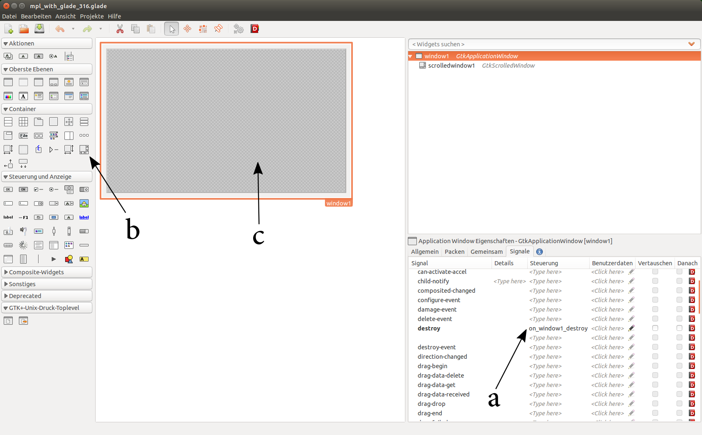

.. _ui_glade:

Glade user interface designer
=============================

Glade is a rapid-application-development program (RAD) or  graphical user-interface-builder, that allows the easy creation of Gtk-applications. The user interface is stored in an XML-file (file extension: *".glade"*), which is called by the main program. The older version of Glade, 3.8.x, targets Gtk+ 2.x applications, while the newer 3.16.x, targets Gtk+ 3.x.

.. _ui_glade_316_python3:

Glade 3.16 example using Python 3
---------------------------------
This example uses Glade 3.16.x and Python 3.x. In order to understand the code it is recommended to work through the Python-GtK3-Tutorial: http://python-gtk-3-tutorial.readthedocs.org/en/latest/. 

The first step is to start Glade and open a new project. Drag a *GtkApplicationWindow* into the work area. In the bottom-right menu you can change the default name from *"applicationwindow1"* to *"window1"*. This is the designation that the window will have in the Python 3 code and in Glade for certain actions. In the *Signals* tab of the same menu open the *GtkWidget* tree and find the *destroy* entry. This is the widget that will allow you to connect the program with the close-button of the window. Enter the action *"on_window1_destroy"* (window1 being the name we gave this window).

In the next step we need to create a container to place the Matplotlib-widget. This tutorial uses a *GtkScrolledWindow*, which you can drag-and-drop on the *GtkApplicationWindow*. Now we are going to save the Glade file into directory with the name *"mpl_with_glade_316.glade"*. Note that there are many options in Glade you can additionally set like the default size of the window. These options are fairly easy to set.

    
    **Figure 1:** First steps of designing a simple user interface in Glade. Allow the window to be closed (a). The GtkScrolledWindow button (b) has to be placed on the main window (c).
    
The code of the finished example will look something like this:

::

        <?xml version="1.0" encoding="UTF-8"?>
        <!-- Generated with glade 3.16.1 -->
        <interface>
          <requires lib="gtk+" version="3.10"/>
          <object class="GtkApplicationWindow" id="window1">
            <property name="can_focus">False</property>
            <property name="title" translatable="yes">Matplotlib</property>
            <property name="default_width">800</property>
            <property name="default_height">600</property>
            <signal name="destroy" handler="on_window1_destroy" swapped="no"/>
            <child>
              <object class="GtkScrolledWindow" id="scrolledwindow1">
                <property name="visible">True</property>
                <property name="can_focus">True</property>
                <property name="border_width">10</property>
                <property name="shadow_type">in</property>
                <child>
                  <placeholder/>
                </child>
              </object>
            </child>
          </object>
        </interface>

The Python 3 file that executes the program can look like this:

::

        #!/usr/bin/env python3

        from gi.repository import Gtk, Gio

        from matplotlib.figure import Figure
        from matplotlib.axes import Subplot
        from numpy import arange, sin, pi
        from matplotlib.backends.backend_gtk3agg import FigureCanvasGTK3Agg as FigureCanvas

        import sys

        class Window1Signals:
            def on_window1_destroy(self, widget):
                Gtk.main_quit()

        def main():
            builder = Gtk.Builder()
            builder.add_objects_from_file("mpl_with_glade_316.glade", ("window1", "") )
            builder.connect_signals(Window1Signals())
            window = builder.get_object("window1")
            sw = builder.get_object("scrolledwindow1")

            #Start of Matplotlib specific code
            figure = Figure(figsize=(8,6), dpi=71)
            axis = figure.add_subplot(111)
            t = arange(0.0, 3.0, 0.01)
            s = sin(2*pi*t)
            axis.plot(t,s)

            axis.set_xlabel('time [s]')
            axis.set_ylabel('voltage [V]')

            canvas = FigureCanvas(figure)  # a Gtk.DrawingArea
            canvas.set_size_request(800,600)
            sw.add_with_viewport(canvas)    
            #End of Matplotlib specific code    
            
            window.show_all()
            Gtk.main()

        if __name__ == "__main__":
            main()

Notice that we defined a function *"the on_window1_destroy"* that we named in Glade. This function ensures that closing the window will quit the Gtk-application. The *GtkScrolledWindow* is first connected through the *Gtk.Builder*, then the Matplotlib-plot is placed in a *FigureCanvas* and this canvas is then added to the *GtkScrolledWindow*.

You can also add the *Matplotlib-NavigationToolbar* to the example. This requires a division of the screen into two scrolled windows (See **Figure 2**).

.. figure:: ../_static/mpl_with_glade_2.png
    :width: 50 %
    :alt: Figure of the Glade interface, showing how to divide the window into 2 scrolled windows.
    :align: left
    
    **Figure 2:** The interface for this example consists of a *GtkApplicationWindow* which is divided into 2 rows using a *GtkBox*. A *GtkScrolledWindow* is placed in both cells (See tree view in upper-right corner).
    
The new Glade-code:

::

        <?xml version="1.0" encoding="UTF-8"?>
        <!-- Generated with glade 3.16.1 -->
        <interface>
          <requires lib="gtk+" version="3.10"/>
          <object class="GtkApplicationWindow" id="window1">
            <property name="can_focus">False</property>
            <property name="title" translatable="yes">Matplotlib</property>
            <property name="default_width">800</property>
            <property name="default_height">600</property>
            <signal name="destroy" handler="on_window1_destroy" swapped="no"/>
            <child>
              <object class="GtkBox" id="box2">
                <property name="visible">True</property>
                <property name="can_focus">False</property>
                <property name="orientation">vertical</property>
                <child>
                  <object class="GtkScrolledWindow" id="scrolledwindow1">
                    <property name="width_request">700</property>
                    <property name="height_request">600</property>
                    <property name="visible">True</property>
                    <property name="can_focus">True</property>
                    <property name="border_width">10</property>
                    <property name="shadow_type">in</property>
                    <child>
                      <placeholder/>
                    </child>
                  </object>
                  <packing>
                    <property name="expand">False</property>
                    <property name="fill">True</property>
                    <property name="position">0</property>
                  </packing>
                </child>
                <child>
                  <object class="GtkScrolledWindow" id="scrolledwindow2">
                    <property name="visible">True</property>
                    <property name="can_focus">True</property>
                    <property name="border_width">10</property>
                    <property name="shadow_type">in</property>
                    <child>
                      <placeholder/>
                    </child>
                  </object>
                  <packing>
                    <property name="expand">False</property>
                    <property name="fill">True</property>
                    <property name="position">1</property>
                  </packing>
                </child>
              </object>
            </child>
          </object>
        </interface>

The new Pyhton code:

::

        #!/usr/bin/env python3

        from gi.repository import Gtk, Gio

        from matplotlib.figure import Figure
        from matplotlib.axes import Subplot
        from numpy import arange, sin, pi
        from matplotlib.backends.backend_gtk3agg import FigureCanvasGTK3Agg as FigureCanvas
        from matplotlib.backends.backend_gtk3 import NavigationToolbar2GTK3 as NavigationToolbar

        import sys

        class Window1Signals:
            def on_window1_destroy(self, widget):
                Gtk.main_quit()

        def main():
            builder = Gtk.Builder()
            builder.add_objects_from_file("mpl_with_glade_316_navigationtoolbar.glade", ("window1", "") )
            builder.connect_signals(Window1Signals())
            window = builder.get_object("window1")
            sw1 = builder.get_object("scrolledwindow1")
            sw2 = builder.get_object("scrolledwindow2")

            #Start of Matplotlib specific code
            figure = Figure(figsize=(4,3), dpi=71)
            axis = figure.add_subplot(111)
            t = arange(0.0, 3.0, 0.01)
            s = sin(2*pi*t)
            axis.plot(t,s)

            axis.set_xlabel('time [s]')
            axis.set_ylabel('voltage [V]')

            canvas = FigureCanvas(figure)
            sw1.add_with_viewport(canvas)

            toolbar = NavigationToolbar(canvas, window)
            sw2.add_with_viewport(toolbar)
            #End of Matplotlib specific code    
            
            window.show_all()
            Gtk.main()

        if __name__ == "__main__":
            main()
            
The finished second example is shown in **Figure 3**.

.. figure:: ../_static/mpl_with_glade_3.png
    :width: 50 %
    :alt: Figure of the Glade interface, showing how to divide the window into 2 scrolled windows.
    :align: left
    
    **Figure 3:** The finished program (shown here in Ubuntu 14.04).