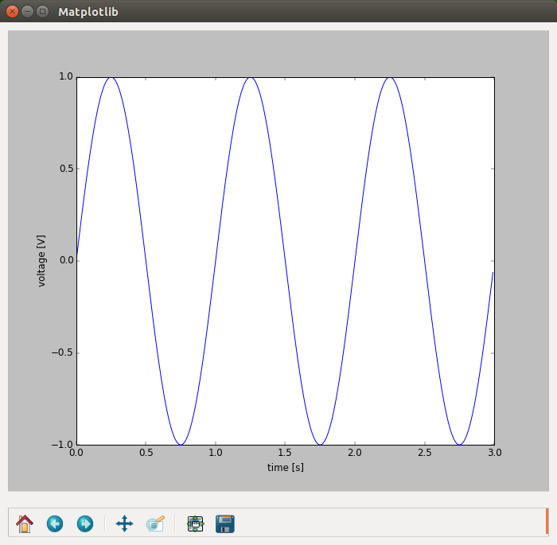
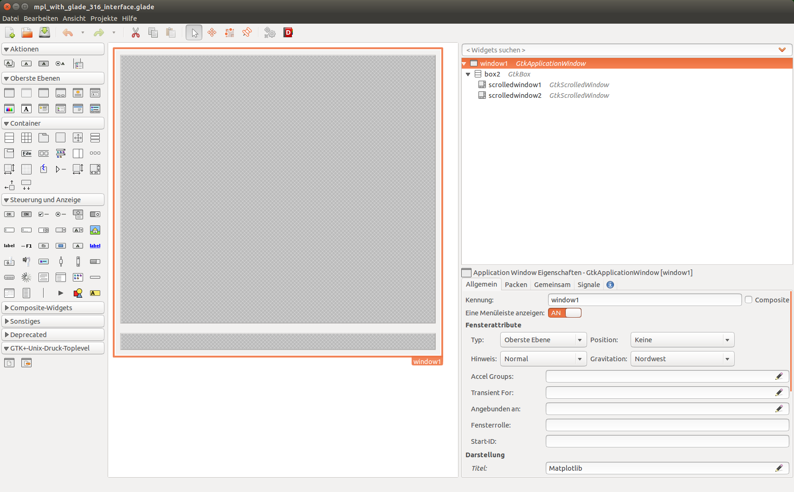

.. _ui_introduction:

Introduction
============

Matplotlib can be placed as a widget into a variety of user-interface frameworks (or user-interface toolkits). This allows one to build custom applications that can display Matplotlib-plots. 

    **Figure 1:** Example of Matplotlib embedded as a widget in a user-interface framework. This example shows the GTK+ 3.x framework under Ubuntu 14.04. *Note that the appearance of the window will depend on the operating system and can additonialy be customized.*

The different frameworks offer different features and programming-language bindings. Most offer graphical user-interface-builders (or rapid-application-development programs) that are useful for larger applications.

The following user-interface frameworks are supported (graphical builders in brackets):

- Gtk+
  
  - Gtk+ 2.x (Glade 3.8.x)
  - Gtk+ 3.x (Glade 3.16.x)

- Qt (Qt-Creator)
  
  - Qt4
  - Qt5
- Tk
- Wx

The different frameworks offer different features and programming-language bindings. The appearance of the user interface will be, by default, similar to the style of the operating system, but can be customized.

    
    **Figure 2:** Glade is just one of many programs that can be used to design more complex user interfaces using a graphical interface.