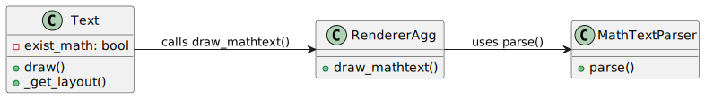

# Report for assignment 4

This is a template for your report. You are free to modify it as needed.
It is not required to use markdown for your report either, but the report
has to be delivered in a standard, cross-platform format.

## Project

Name: matplotlib

URL: https://github.com/matplotlib/matplotlib

Matplotlib is a comprehensive library for creating static, animated, and interactive visualizations. Matplotlib can be used in Python scripts, Python/IPython shells, web application servers as well as various graphical user interface toolkits, which produces
high-quality figures for different types of input.

## Onboarding experience

Did you choose a new project or continue on the previous one?

For lab4, we chose a new project ([matplotlib](https://github.com/matplotlib/matplotlib)) instead of the previous one ([jsoniter](https://github.com/json-iterator/java))

If you changed the project, how did your experience differ from before?

## Effort spent

For each team member, how much time was spent in

|     | Xu Zuo    | Biming Wen    | Gustav Nordström | Gustav Wallin |
|:---:|:-----------:|:---------------:|:---:|:---:|
|1  |0  |0  |0  |0  |
|2  |0  |0  |0  |0  |
|3  |0  |0  |0  |0  |
|4  |0  |0  |0  |0  |
|5  |0  |0  |0  |0  |
|6  |0  |0  |0  |0  |
|7  |0  |0  |0  |0  |
|8  |0  |0  |0  |0  |

1. plenary discussions/meetings;

2. discussions within parts of the group;

3. reading documentation;

4. configuration and setup;

5. analyzing code/output;

6. writing documentation;

7. writing code;

8. running code?

For setting up tools and libraries (step 4), enumerate all dependencies
you took care of and where you spent your time, if that time exceeds
30 minutes.

## Overview of issue(s) and work done.

Title: \[Bug\]: unaligned multiline text when using math mode

URL: https://github.com/matplotlib/matplotlib/issues/29527

Summary in one or two sentences

When rendering multiline text where one line includes math mode (e.g., `$...$`), while another does not, the lines are not perfectly aligned. Specifically, the line containing math mode text appears slightly misaligned compared to the non-math text line, leading to an unintended visual offset.

Scope (functionality and code affected).

**Functinality**: This issue affects the rendering of multiline text in Matplotlib, particularly when mixing regular text and math mode text. The misalignment causes inconsistent vertical positioning of the text lines.

**Code affected**: The issue is primarily related to the `matplotlib.text.Text` class (in `text.py`), particularly the `_get_layout()` method, which is responsible for computing the layout of multiline text. It also involves `MathTextParser.parse()` in `_mathtext.py`, where differences in baseline and height calculations between math mode and regular text lead to misalignment. Additionaly, it relates to how the `backend` works/is when matplotlib running on different platforms (e.g., `linux`, `macos` or `windows`). Specifically, `draw_mathtext()` and `draw_text()` (see in `backend_agg.py` as an example) directly affect it, and a tricky function is `_get_text_metrics_with_cache()` which is called in `_get_layout()` in `text.py`, since there are the **same characters** in the two lines in this issue.

**Work done**

- Introduced a new attribute/field (`self.exist_math`) for each object from `Text Class` in `text.py`. The initial value is `False`, when creating a new `text` object from `Text Class` with `math text`, then `self.exist_math = True`.

- Refactored `draw()` in `text.py`. We first check whether the input text contains `math text` or not, if so, `self.exist_math = True`. Then we use this field as a parameter when calling `draw_text()`.

- Refactored `draw_mathtext()` in `backend_agg.py` and `_get_layout()` in `text.py`. We added new conditional judgment, if there's math text, we treat the entire text as math text for further calculating.

- Our solution works for the aim [issue](https://github.com/matplotlib/matplotlib/issues/29527), though it's not a perfect/solid one.

## Requirements for the new feature or requirements affected by functionality being refactored

Optional (point 3): trace tests to requirements.

### Existing Tests

In the original Matplotlib repository, `backend_agg.py`, `text.py` and `_mathtext.py` are directly related to [`issue#29527`](https://github.com/matplotlib/matplotlib/issues/29527). Although when we ran `pytest lib/matplotlib/tests` and the corresponding tests (`test_agg.py`, `test_text.py` and `test_mathtext.py`) passed, we looked close to the test code and found that no test covered the issue, i.e., **mixed math and normal text alignment issues**. Thus, we introduced new tests here.

### Updated/New Tests

To validate our fix for issue **#29527**, we introduced a new automated test case in `test_mixedmathtext.py`. This test ensures that when a string contains both **math expressions and normal text across multiple lines**, the **vertical bars (`||`) remain visually aligned** after the fix.

#### Test Implementation:
1. Create a Matplotlib figure and add a text object containing `"$k$1||\n1||"`.
2. Trigger layout computation by calling `fig.canvas.draw()`.
3. Extract the rendered text dimensions:
4. Use `MathTextParser.parse()` to separately compute the **widths of each line** (`$k$1||` and `1||`).
5. Calculate `x_offset = abs(width_math - width_normal)` to measure the X-axis misalignment of the `||` characters.
6. Ensure `x_offset < 1px`, verifying that the vertical bars are correctly aligned after the fix.
Additional Considerations:

#### Test Parameterization:
- The test runs for both `usetex=False` (MathText) and `usetex=True` (LaTeX mode) to ensure correctness across different rendering backends.
- Automated Testing Integration:
This test is part of the Matplotlib automated test suite, ensuring that any future modifications to text rendering do not reintroduce this issue.

  run:
  ```shell
  pytest lib/matplotlib/tests/test_mixedmathtext.py 
  ```

### Trace to Requirements

- Requirement:

  When a multi-line text contains a math expression, the text should be rendered consistently to ensure aligned vertical elements (e.g., || should not be misaligned across lines).

- Test Validation:

  - Before the fix:
Inconsistent handling of mixed math and normal text caused || to be misaligned.
  - After the fix:
If one line contains math text, the entire block is processed as math text, ensuring alignment.
  - The test confirms this by checking that x_offset < 1px, meaning the visual alignment of || is corrected.

- Impact on Matplotlib Rendering:

  Ensures consistent text layout when mixing math and normal text across multiple lines. Prevents regressions in both MathText (usetex=False) and LaTeX (usetex=True) rendering modes.

## Code changes

### Patch

Optional (point 4): the patch is clean.

For a clean patch, please refer to [`Commit 49b7d8a`](https://github.com/floralsea/matplotlib-dd2480-group21-lab4/commit/49b7d8a758991904d77fec08ae3f85eb81532fb9.patch).

However, the above commit is for the optional point 4, so generally there're no code changes, the main change is "removing unused code and adding comments". The **code changes** are mainly in the following commits: the first try is [`Commit 91a389d`](https://github.com/floralsea/matplotlib-dd2480-group21-lab4/commit/91a389d9754209c6abf2ea96dee2297cbc227f5c) and a better solution is [`Commit ad1196e`](https://github.com/floralsea/matplotlib-dd2480-group21-lab4/commit/ad1196ef9255e908b3db30f05a19d856812317cc#diff-2889b798b7f9a072d882bef4f0fc033db63538a9317df59fa963e9a82401bf40)

Optional (point 5): considered for acceptance (passes all automated checks).

## Test results

For the original test results, you can refer to [`./result_images`](https://github.com/floralsea/matplotlib-dd2480-group21-lab4/tree/main/result_images). Since the test results were rendered into **images**, the test results 
were under [`./result_images`](https://github.com/floralsea/matplotlib-dd2480-group21-lab4/tree/main/result_images). Although there were **fails** when we deployed it locally, these fails didn't affect our target issue. To be specific, [`test_agg`](https://github.com/floralsea/matplotlib-dd2480-group21-lab4/tree/main/result_images/test_agg) and [`test_text`](https://github.com/floralsea/matplotlib-dd2480-group21-lab4/tree/main/result_images/test_text) are directly affected by our refactoring.

Unfortunately, after our refactoring, we failed to pass the origianl tests.

For the test results, you can refer to [./resources](https://github.com/floralsea/matplotlib-dd2480-group21-lab4/tree/main/resources).

## UML class diagram and its description

The following UML diagram illustrates the key changes introduced in our fix for issue **#29527**. The modifications primarily affect the **Text class** in `text.py`, the `draw_mathtext()` method in `backend_agg.py`, and the **text layout calculations** in `_get_layout()`.



#### Key updates reflected in the diagram:

- New attribute `exist_math`

  Introduced in the `Text class` (`text.py`).
Initially set to `False`, but updated to `True` if **math text** is detected.

- Refactored `draw()` method in `text.py`

  Now checks if the input text contains **math expressions** and updates `exist_math` accordingly.
Passes this information to `draw_text()` for further rendering.

- Changes in `backend_agg.py` (`draw_mathtext()`)

  A conditional statement was added to ensure that if any line contains **math text**, the **entire text block** is processed as math text.

- Modifications in `_get_layout()` (`text.py`)

  Adjusted how text layout is computed based on the `exist_math` flag.

**Note**: We use the online tool [PlantUML](https://www.planttext.com/) to produce/draw our class diagram.

### Key changes/classes affected

Optional (point 1): Architectural overview.

We wrote the archtectural overview before and after our fix in [dd2480_lab4_option_1.pdf](resources/dd2480_lab4_option_1.pdf), please refer to it for detailed information.

Optional (point 2): relation to design pattern(s).

You can find the sub-report in [./resources/option2.md](resources/option2.md)

## Overall experience

What are your main take-aways from this project? What did you learn?

How did you grow as a team, using the Essence standard to evaluate yourself?

Optional (point 6): How would you put your work in context with best software engineering practice?

Optional (point 7): Is there something special you want to mention here?
